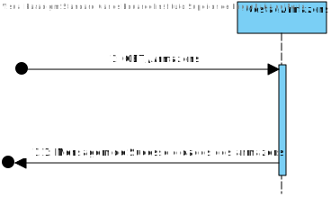
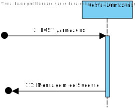
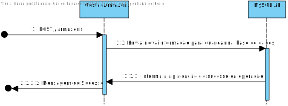
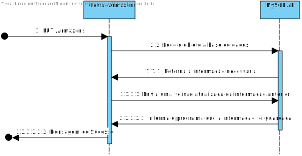
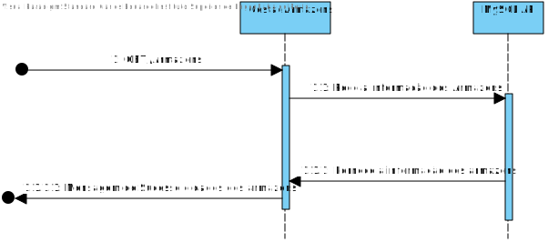
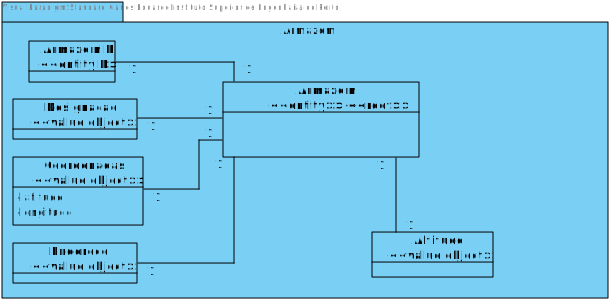
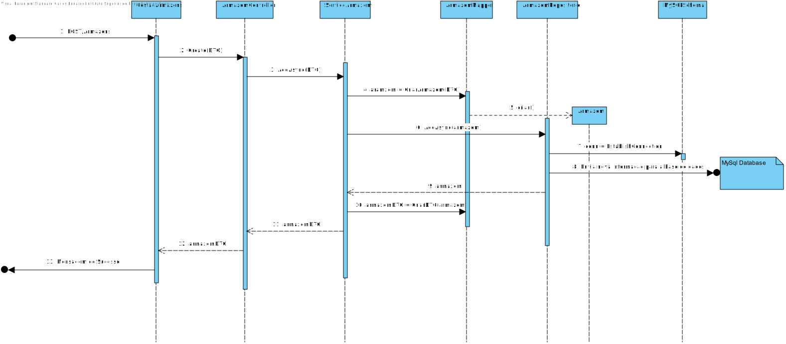
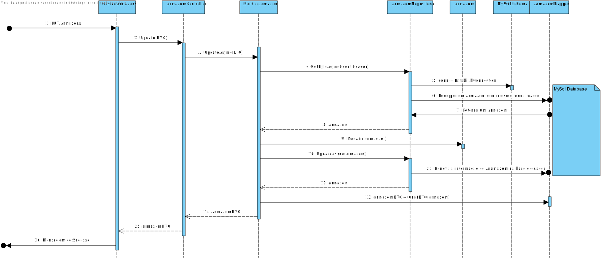
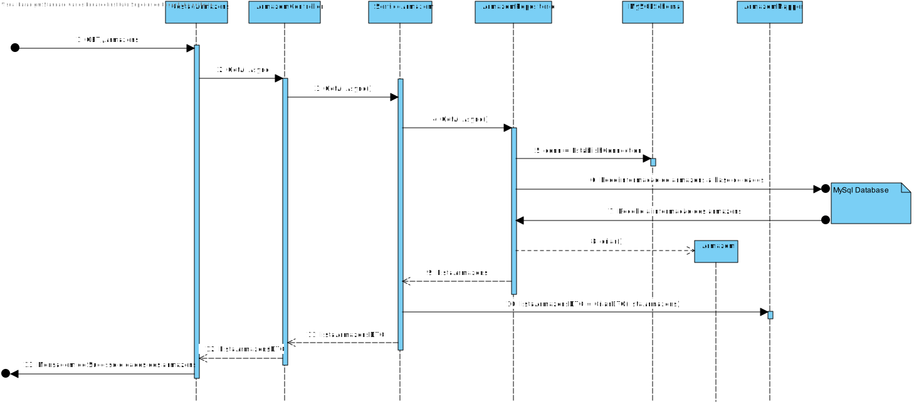
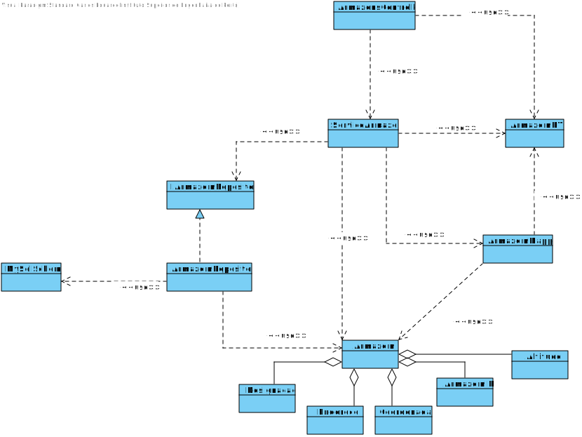

# UC001
=======================================

# 1. Requisitos

Serviço REST de dados mestre de armazém que permita Criar, Listar e Editar Armazéns. 

### 1.1. Especificações e Clarificações do Cliente  

 **Encontradas no Caderno de Encargos:**
 
>Um armazém é caracterizado por:
>	- Identificador do armazém, ex., “M01”
>	- Designação, ex., “Maia Norte”
>	- Endereço, ex., “Av Frederico Ulrich, Zona industrial I, 4444-999”
>	- Coordenadas geográficas (latitude e longitude)

 **De clarificações do Cliente:**
 
>**Pergunta:** "Gostaríamos de saber se existem algumas restrições relativamente ao endereço, designação e identificação que a empresa especifique (como tamanho, formato, entre outros)?"
>
>**Resposta:** "O endereço segue as regras de endereços postais Portugueses devendo consistir na morada, localidade e código postal, ex:
>
> - Rua Dr. António Bernardino de Almeida, 431
> - 4249-015 Porto
> - Portugal
> 
>A identificação do armazém é um código alfanumérico obrigatório com 3 caracteres.
>
>A designação é um texto obrigatório com um máximo de 50 caracteres. normalmente será o nome da cidade/localidade onde o armazém está colocado "

>**Pergunta:** "Dentro das informações do Armazém (Id, Designação, Endereço, Coordenadas, Altitude) qual/quais são editáveis?"
>
>**Resposta:** "A identificação do armazém não é editavel. a restante informação é."

>**Pergunta:** "Porque atributos gostaria que a filtragem dos armazéns fosse feita?"
>
>**Resposta:** "Pelo seu identificador e designação."

>**Informação adicional** "Caros alunos, o ficheiro de dados exemplo foi atualizado contendo agora um atributo adicional de localização de cada armazem corresponde à altitude da localização do armazem."

### 1.2. Critérios de Aceitação

Neste caso de uso, os critérios de aceitação encontrados foram:

- Deve ser possivel Criar um Armazem
- Deve ser possivel Editar todos os elementos do Armazem fora o ID
- Deve ser possivel Listar um armazem usando o seu ID
- Deve ser possivel Listar um armazem usando a sua Designacao

# 2. Análise

Este UC faz uso dos seguintes agregados:
- Armazém 

[(Domain Diagram)](../../Modelo_de_Dominio/DM.svg)

O agregdo faz parte da area de Gestão do projeto integrador pelo que a UC será produzida em ASP.NET

# 3. Design

Este UC faz uso do REST para implementar um API que permite responder a requests PUT, POST e GET pelo que, estas requests tem necessidade de responder aos criterios e restrições impostas pelo cliente.

## 3.1. Nível 1

### SSD - POST

## 3.2. Nível 2

### SD - POST

### SD - PUT

### SD - GET

## 3.3. Nível 3

## MD

### SSD - POST

### SSD - PUT

### SSD - GET

### CD

## 3.4. Testes 

Dois tipos de Testes foram realizados

**Dominio**

Testes ao dominio da user storie EX: value objects, agregate root, DTO e Mapper

**Integraçao**

Testes aos controlers e servicos da User story.
É usado o mock da class de repositorio para testar eficientemente

