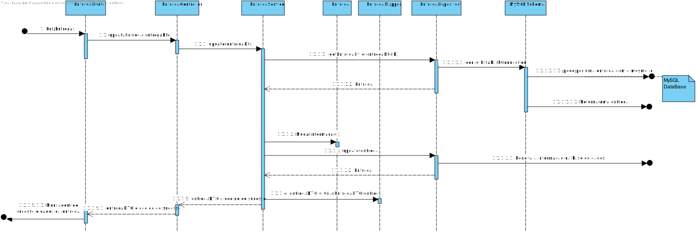

# Entregas
=======================================

# 1. Requisitos

Serviço REST de dados mestre de armazém para: Criar, Listar e Editar Entrega.

### 1.1. Especificações e Clarificações do Cliente  

 **Encontradas no Caderno de Encargos:**
 
>A informação que a empresa possui sobre as entregas são as seguintes:
>	- Identificador da entrega, ex., “220909/1”
>	- Data da Entrega (dia, mês, ano)
>	- Massa da entrega (em kg, associada ao peso dos produtos a entregar)
>	- Armazém para efetuar a entrega: identificador da loja
>	- Tempo para colocar uma entrega no camião (em minutos)
>	- Tempo para retirar a entrega do camião (em minutos)

 **De clarificações do Cliente:**
 
>**Pergunta:** "Pretende que Listemos sempre as Entregas todas ou poderemos querer listar por estados diferentes de Entregas?"
>
>**Resposta:** "bom dia, deve ser possivel filtrar as entregas pelo armazem a que se destinam e entre datas"

>**Pergunta:** "Quais as informações a que pretende visualizar depois de feito o pedido de listagem? Qual o formato que pretende visualizar - 
Exemplo: Ficheiro ou Dados numa página Web?"
>
>**Resposta:** "bom dia, deve ser possivel visualizar toda a informação das entregas para um dado dia com possibilidade de filtragem e ordenação por armazém. A visualização será efetuada na user interface a desenvolver no sprint B"

>**Pergunta:** No caso das entregas, pretende conseguir editar a informação de uma forma parcial (PATCH) ou de uma forma total (PUT)?
>
>**Resposta:** boa tarde, essa pergunta é sobre aspetos técnicos e não funcionais.
funcionalmente é necessário ter atenção a quais os dados que podem ser alterados ou não. por exemplo, não se pode alterar o identificador da entrega. No entanto o utilizador deve ser livre de escolher qua o subconjunto de dados que pretende alterar

### 1.2. Critérios de Aceitação

Neste caso de uso, os critérios de aceitação encontrados foram:

- Deve ser possível Criar uma Entrega nova
- Deve ser possivel Editar todos os elementos do Entrega menos o ID
- Deve ser possivel Listar uma entrega usando o seu ID
- Deve ser possivel Listar uma entrega usando o ID do Armazém
- Deve ser possivel Listar uma entrega em que a data se encontre entre as duas datas especificadas
- Uma Entrega deve ter os seguintes dados:
	- Identificador da entrega, ex., “220909/1”
	- Data da Entrega (dia, mês, ano)
	- Massa da entrega (em kg, associada ao peso dos produtos a entregar)
	- Armazém para efetuar a entrega: identificador da loja
	- Tempo para colocar uma entrega no camião (em minutos)
	- Tempo para retirar a entrega do camião (em minutos)

# 2. Análise

Este UC faz uso dos seguintes agregados:
- Entrega

[(Domain Diagram)](../../Modelo_de_Dominio/DM.svg)

Como os dois agregados pertencem a diferentes partes do Sistema, Percurso pertence a Logística e Armazém pertence à Gestão de Armazens, vai ser necessário utilizar o API desenvolvido em .NET, ou seja o API da Gestão de Armazens, para obter a informação necessária.

# 3. Design

Em termos de design podemos ver que este Use Case está dividido em POST, GET e PUT, isto para ir de encontro com as especificações impostas pelo cliente, que já foram estudadas nos pontos anteriores.

## 3.1. Nível 1

### SSD - POST

### SSD - PUT

### SSD - GET

## 3.2. Nível 2

### SD - POST

### SD - PUT

### SD - GET

## 3.3. Nível 3

### SSD - POST

### SSD - PUT

### SSD - GET

### CD

## 3.4. Testes 

# 4. Implementação

# 5. Integração/Demonstração

# 6. Observações

