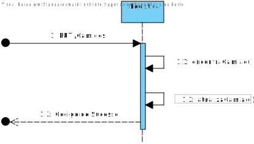

# UC003
=======================================

# 1. Requisitos

Serviço REST de dados mestre de logística para: Criar, Listar e Editar Camioes.

### 1.1. Especificações e Clarificações do Cliente

**Encontradas no Caderno de Encargos:**

>Os camiões elétricos têm as seguintes caraterísticas:
>- Tara (peso do camião sem carga, ou seja, vazio): ex., 7,5 toneladas
>- Capacidade de Carga (a massa que pode ser transportada no camião): ex., 4,3 toneladas
>- Carga máxima do conjunto de baterias elétricas do camião (energia acumulada nas
baterias): ex., 80 kWh (quilo watt hora)
>- Autonomia do camião com toda a capacidade de carga (ex., 4,3 toneladas) e com as
baterias elétricas completamente carregadas: ex., 100 km 
>- Tempo de carregamento rápido das baterias do camião (para carregar as baterias desde
o mínimo de carga elétrica recomendado, 20%, até um valor padrão de 80%): ex., 1 hora 

**De clarificações do Cliente:**

>**Pergunta:** "Os sistemas de carregamento rápido e lento são diferentes, ou é apenas uma configuração do mesmo sistema?"
> 
>**Resposta:** "São sistemas diferentes"

>**Pergunta** "Pretende que a matrícula do camião seja gerada automaticamente na sua criação ou inserida manualmente?"
> 
>**Resposta** "A matricula não pode ser gerada automaticamente e terá que ser introduzida pelo utilizador"
 
>**Pergunta** "Caso seja gerada automaticamente o seu formato será o português "AZ-19-AZ" ou tem de suportar os formatos dos vários países?"
> 
>**Resposta** "Apenas existem matriculas portuguesas emitidas pelo IMT" 

>**Pergunta** "Pretende que seja possível editar as informações de um camião todas de uma vez ou prefere primeiro indicar quais as informações que se pretende editar e só depois editar as informações?"
> 
>**Resposta** "a matricula do camião não pode ser alterada em nenhum cenário
os restantes atributos podem ser alterados, devendo o sistema estar preparado para poder alterar um subconjunto de atributos"

### 1.2. Critérios de Aceitação

Neste caso de uso, os critérios de aceitação encontrados foram:

- Deve ser possível Criar um Camiao novo
- Deve ser possível Editar um Camiao já existente, tendo em conta:
    - Deve ser possivel listar todos os camioes
    - Não pode ser possível alterar a matricula de um camiao ja criado
    - É possivel alterar um subconjunto de atributos
- Deve ser possível Listar um Camiao já existente
- Um camiao deve ter os seguintes dados:
    - Identificação do camiao (matricula)
    - Peso da tara
    - Capacidade maxima de carga (massa total que o camiao consegue transportar)
    - Carga máxima das baterias
    - Autonomia do camiao
    - Tempo de carregamento rapido
    - Tempo de carregamento lento

# 2. Análise

Este UC faz uso dos seguintes agregados:
- Camiao

[(Domain Diagram)](../../Modelo_de_Dominio/DM.svg)

# 3. Design

Em termos de design podemos ver que este UC está dividido em POST, GET e PUT, isto para ir de encontro com as especificações impostas pelo cliente, que já foram estudadas nos pontos anteriores.

## 3.1. Nível 1

### SSD - GET

### SSD - POST

### SSD - PUT

## 3.2. Nível 2

### SD - GET

### SD - POST

### SD - PUT

## 3.3. Nível 3

### SSD - GET

### SSD - POST

### SSD - PUT

### CD

## 3.4. Testes

**CamiaoController.test.ts**

    it('Devia retornar um json com a informação do criar...', async function () {
        let req: Partial<Request> = {};
		req.body = body;

        let res: Partial<Response> = {
			json: sinon.spy()
        };

		let next: Partial<NextFunction> = () => {};

		sinon.stub(camiaoServiceInstance, "createCamiao").returns( Result.ok<ICamiaoDTO>( 
            {
                "id": "AA-00-00", 
                "tara": 800,
                "capacidadeCargaTotal": 1200,
                "camiaoBateria": 80,
                "autonomiaCamiao": 900,
                "carregamentoLento": 50,
                "carregamentoRapido": 10
            }));

		const ctrl = new CamiaoController(camiaoServiceInstance as ICamiaoService);

		await ctrl.createCamiao(<Request>req, <Response>res, <NextFunction>next);

		sinon.assert.calledOnce(res.json);
		sinon.assert.calledWith(res.json, sinon.match(
            {
                "autonomiaCamiao": 900,
                "camiaoBateria": 80,
                "capacidadeCargaTotal": 1200,
                "carregamentoLento": 50,
                "carregamentoRapido": 10,
                "id": req.body.domainId,
                "tara": 800,
            }));
        
        camiaoServiceInstance.createCamiao.restore();
	});

    it('Devia retornar um erro 402 ao criar...', async function () {
        let req: Partial<Request> = {};

        let res: Partial<Response> = {
			status: sinon.spy()
        };

		let next: Partial<NextFunction> = () => {};

		sinon.stub(camiaoServiceInstance, "createCamiao").returns( Result.fail( "error message" ));

		const ctrl = new CamiaoController(camiaoServiceInstance as ICamiaoService);

		await ctrl.createCamiao(<Request>req, <Response>res, <NextFunction>next);

		sinon.assert.calledOnce(res.status);
		sinon.assert.calledWith(res.status, sinon.match( 402));
        
        camiaoServiceInstance.createCamiao.restore();
	});

**CamiaoService.test.ts**

        it('Devia retornar um DTO ao criar...', async function () {
        sinon.stub(camiaoRepoInstance, "save").returns( null );

		const serv = new CamiaoService(camiaoRepoInstance as ICamiaoRepo);

		let resultadoObtido = await serv.createCamiao( camiaoDTO );
        let valorObtido = resultadoObtido.getValue();

        camiaoRepoInstance.save.restore();
        
        expect(resultadoObtido.isSuccess).to.be.true;
        expect(valorObtido).to.be.equal( camiaoDTO );
	});

    it('Devia retornar uma lista de DTO ao listar Todos...', async function () {
        let lista = [camiao];
        sinon.stub(camiaoRepoInstance, "encontraTodosCamioes").returns( lista );

		const serv = new CamiaoService(camiaoRepoInstance as ICamiaoRepo);

		let resultadoObtido = await serv.encontraTodosCamioes();
        let valorObtido = resultadoObtido.getValue();

        camiaoRepoInstance.encontraTodosCamioes.restore();
        
        expect(resultadoObtido.isSuccess).to.be.true;
		expect(valorObtido.pop()).to.be.equal( camiaoDTO );
        expect(valorObtido.length).to.be.equal(0);
	});

# 4. Implementação

**CamiaoService**

    @Service()
    export default class CamiaoService implements ICamiaoService {
    constructor(
        @Inject(config.repos.camiao.name) private camiaoRepo : ICamiaoRepo
    ) {}

    public async getCamiao( camiaoId: string): Promise<Result<ICamiaoDTO>>{
        try{
            const camiao = await this.camiaoRepo.findByDomainId(camiaoId);

            if(camiao === null) {
                return Result.fail<ICamiaoDTO>("Camiao not found");
            } else {
                const camiaoDTOResult = CamiaoMap.toDTO( camiao ) as ICamiaoDTO;
                return Result.ok<ICamiaoDTO>( camiaoDTOResult )
            }
        } catch (e) {
            throw e;
        }
    }

    public async encontraTodosCamioes(): Promise<Result<ICamiaoDTO[]>> {
        try{
            let camiaoList: Camiao[] = [];
            camiaoList = await this.camiaoRepo.encontraTodosCamioes();
            let result: ICamiaoDTO[] = [];
            for(let camiao of camiaoList){
                let camiaoDTOResult = CamiaoMap.toDTO(camiao) as ICamiaoDTO;
                result.push(camiaoDTOResult);
            }

            if(result.length != 0){
                return Result.ok<ICamiaoDTO[]>(result);
            }
        }catch(e){
            throw e;
        }
    }

    public async createCamiao(camiaoDTO: ICamiaoDTO): Promise<Result<ICamiaoDTO>> {
        
        try{
            const tara = Tara.create(camiaoDTO.tara).getValue();
            const capacidadeCargaTotal = CargaTotal.create(camiaoDTO.capacidadeCargaTotal).getValue();
            const camiaoBateria = CamiaoBateria.create(camiaoDTO.camiaoBateria).getValue();
            const autonomiaCamiao = AutonomiaCamiao.create(camiaoDTO.autonomiaCamiao).getValue();
            const carregamentoLento = CarregamentoLento.create(camiaoDTO.carregamentoLento).getValue();
            const carregamentoRapido = CarregamentoRapido.create(camiaoDTO.carregamentoRapido).getValue();
            const id = new CamiaoId(camiaoDTO.id);

            const camiaoOrError = await Camiao.create({ 
                tara: tara,
                capacidadeCargaTotal: capacidadeCargaTotal,
                camiaoBateria: camiaoBateria,
                autonomiaCamiao: autonomiaCamiao,
                carregamentoLento: carregamentoLento,
                carregamentoRapido: carregamentoRapido,
            }, id);

            if(camiaoOrError.isFailure){
                return Result.fail<ICamiaoDTO>(camiaoOrError.errorValue());
            }

            const camiaoResult = camiaoOrError.getValue();

            await this.camiaoRepo.save(camiaoResult);

            const camiaoDTOResult = CamiaoMap.toDTO( camiaoResult ) as ICamiaoDTO;
            return Result.ok<ICamiaoDTO>( camiaoDTOResult );
        }catch(e){
            throw e;
        }
    }

    public async updateCamiao(camiaoDTO: ICamiaoDTO): Promise<Result<ICamiaoDTO>> {
        try{
            const camiao = await this.camiaoRepo.findByDomainId(camiaoDTO.id);

            if(camiao === null) {
                return Result.fail<ICamiaoDTO>("Camiao not found");
            }else{
                const tara = Tara.create(camiaoDTO.tara).getValue();
                const capacidadeCargaTotal = CargaTotal.create(camiaoDTO.capacidadeCargaTotal).getValue();
                const camiaoBateria = CamiaoBateria.create(camiaoDTO.camiaoBateria).getValue();
                const autonomiaCamiao = AutonomiaCamiao.create(camiaoDTO.autonomiaCamiao).getValue();
                const carregamentoLento = CarregamentoLento.create(camiaoDTO.carregamentoLento).getValue();
                const carregamentoRapido = CarregamentoRapido.create(camiaoDTO.carregamentoRapido).getValue();

                camiao.tara = tara;
                camiao.capacidadeCargaTotal = capacidadeCargaTotal;
                camiao.camiaoBateria = camiaoBateria;
                camiao.autonomiaCamiao = autonomiaCamiao;
                camiao.carregamentoLento = carregamentoLento;
                camiao.carregamentoRapido = carregamentoRapido;
                await this.camiaoRepo.save(camiao);

                const camiaoDTOResult = CamiaoMap.toDTO( camiao ) as ICamiaoDTO;
                return Result.ok<ICamiaoDTO>( camiaoDTOResult );
            }
        } catch(e) {
            throw e;
        }
    }
    }

**CamiaoRepo**

    @Service()
    export default class CamiaoRepo implements ICamiaoRepo{
    private models: any;

    constructor(
        @Inject('camiaoSchema') private camiaoSchema : Model<ICamiaoPersistence & Document>,
    ) {}

    private createBaseQuery(): any {
        return {
            where: {},
        }
    }

    public async exists(camiao: Camiao): Promise<boolean> {

        const idX = camiao.id instanceof CamiaoId ? (<CamiaoId>camiao.id).toValue() : camiao.id;

        const query = {domainId: idX};
        const camiaoDocument = await this.camiaoSchema.findOne( query as FilterQuery<ICamiaoPersistence & Document>);

        return !!camiaoDocument === true;
    }

    public async save(camiao: Camiao): Promise<Camiao> {
        const query = {domainId: camiao.id.toString()};

        const camiaoDocument = await this.camiaoSchema.findOne( query );

        try{
            if(camiaoDocument === null){
                
                const rawModel: any = CamiaoMap.toPersistence(camiao);
                const camiaoCreated = await this.camiaoSchema.create(rawModel);
                return CamiaoMap.toDomain(camiaoCreated);
            } else {
                camiaoDocument.tara = camiao.tara.value;
                camiaoDocument.capacidadeCargaTotal = camiao.capacidadeCargaTotal.value;
                camiaoDocument.camiaoBateria = camiao.camiaoBateria.value;
                camiaoDocument.autonomiaCamiao = camiao.autonomiaCamiao.value;
                camiaoDocument.carregamentoLento = camiao.carregamentoLento.value;
                camiaoDocument.carregamentoRapido = camiao.carregamentoRapido.value;
                await camiaoDocument.save();
                return camiao;

            }
        } catch (err) {
            throw err;
        } 
    }

    public async findByDomainId (camiaoId: CamiaoId | string): Promise<Camiao> {
        const idX = camiaoId instanceof CamiaoId ? (<CamiaoId>camiaoId).toString() : camiaoId;

        const query = { domainId: idX }; 
        const userRecord = await this.camiaoSchema.findOne( query );
        const test = await this.camiaoSchema.find();

        if( userRecord != null) {
            return CamiaoMap.toDomain(userRecord);
        }
        else
            return null;
    }

    public async encontraTodosCamioes(): Promise<Camiao[]>{
        const camiaoRecord = await this.camiaoSchema.find();

        let camiaoList: Camiao[] = [];
        for(let camiao of camiaoRecord){
            camiaoList.push(CamiaoMap.toDomain(camiao));
        }
        return camiaoList;
    }
    }

**CamiaoController**

    @Service()
    export default class CamiaoController implements ICamiaoController /*extends BaseController*/ {
    constructor(
        @Inject(config.services.camiao.name) private camiaoServiceInstance : ICamiaoService
    ) {}

    public async createCamiao(req: Request, res: Response, next: NextFunction) {
        try{
            const camiaoOrError = await this.camiaoServiceInstance.createCamiao(req.body as ICamiaoDTO) as Result<ICamiaoDTO>;

            if(camiaoOrError.isFailure){
                return res.status(402).send(camiaoOrError.error);
            }

            const camiaoDTO = camiaoOrError.getValue();
            return res.json( camiaoDTO ).status(201);
        }catch(e){
            return next(e);
        }
    };

    public async updateCamiao(req: Request, res: Response, next: NextFunction) {
        try{
            const camiaoOrError = await this.camiaoServiceInstance.updateCamiao(req.body as ICamiaoDTO) as Result<ICamiaoDTO>;

            if (camiaoOrError.isFailure){
                return res.status(404).send(camiaoOrError.error);
            }

            const camiaoDTO = camiaoOrError.getValue();
            return res.json( camiaoDTO ).status(201);
        }catch(e){
            return next(e);
        }
    };

    public async getCamiao(req: Request, res: Response, next: NextFunction) {
        try{
            const camiaoOrError = await this.camiaoServiceInstance.getCamiao(req.params.id as string) as Result<ICamiaoDTO>;
            
            
            if(camiaoOrError.isFailure){
                return res.status(404).send(camiaoOrError.error.toString());
            }
            
            const camiaoDTO = camiaoOrError.getValue();
            res.json(camiaoDTO).status(202);
        }catch(e){
            return next(e);
        }
    }

    public async encontraTodosCamioes(req: Request, res: Response, next: NextFunction) {
        try{
            let camiaoOrError = await this.camiaoServiceInstance.encontraTodosCamioes() as Result<ICamiaoDTO[]>;

            if(camiaoOrError.isFailure){
                return res.status(404).send(camiaoOrError.error.toString());
            }

            const camiaoDTO = camiaoOrError.getValue();
            res.json(camiaoDTO).status(202);

        }catch(e){
            return next(e);
        }
    }
    }
