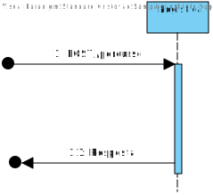
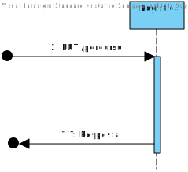
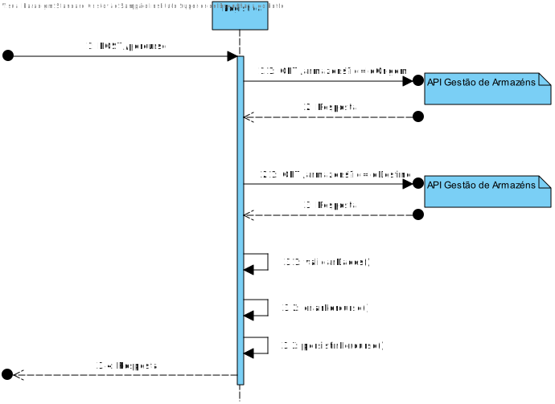
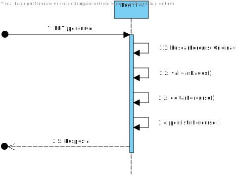
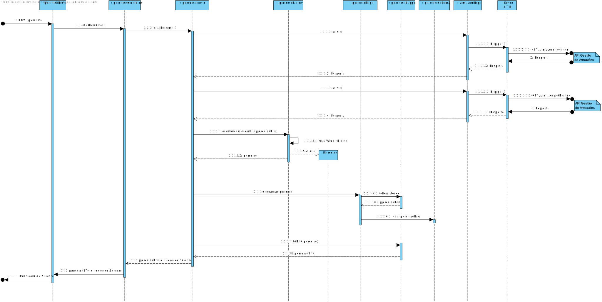
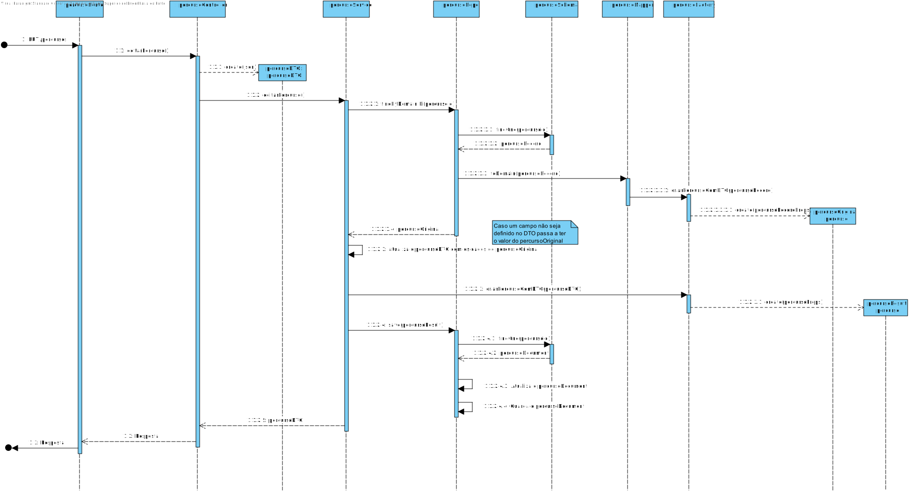
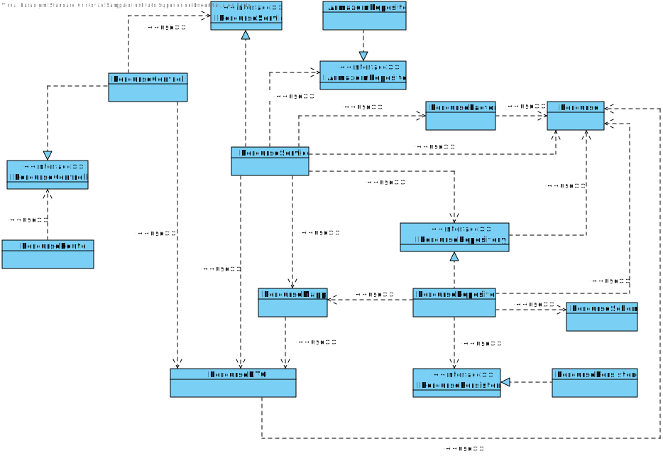

# UC004
=======================================

# 1. Requisitos

Serviço REST de dados mestre de logística para: Criar, Listar e Editar Percurso entre dois armazéns.

### 1.1. Especificações e Clarificações do Cliente  

 **Encontradas no Caderno de Encargos:**
 
>A informação que a empresa possui sobre os melhores caminhos entre dois armazéns são os seguintes:
>	- Identificação do armazém de partida
>	- Identificação do armazém de chegada
>	- Distância (em km)
>	- Tempo (em minutos) para percorrer a distância com o camião completamente cheio, ou seja, com a carga de 4,3 toneladas
>	- Energia gasta da bateria para percorrer essa distância com o camião completamente cheio (em kWh)
>	- Tempo extra se for necessário um carregamento extra da bateria (este dado é apenas diferente de 0 quando a carga das baterias a 80% feita previamente não é suficiente para percorrer completamente o troço, como por exemplo para um camião que carrega 4,3 toneladas e que tem de ir da Póvoa do Varzim para Arouca)

 **De clarificações do Cliente:**
 
>**Pergunta:** "É possível existir mais do que um percurso com os mesmos identficadores de armazém de partida e chegada?"
>
>**Resposta:** "Do ponto de vista do módulo de Planeamento só estamos a considerar um percurso em cada sentido entre os armazéns, assume-se que é o melhor percurso entre esses armazéns. Notar que o percurso entre o armazém A e o armazém B é diferente do percurso entre o armazém B e o A, podendo envolver distâncias, tempos e consumos energéticos diferentes ao serem percorridos."

>**Pergunta:** "Como é que é pretendido encontrar o percurso que deseja editar? Por algum dos seus dados?"
>
>**Resposta:** "Pelo armazem de origem e/ou de destino."

>**Pergunta:** O que é pretendido quanto à listagem?
>
>Listar só um percurso, ou listar os percursos de acordo com uma determinda filtragem e ordem?
>
>Caso seja pretendida a segunda opção, deseja que seja ordenado e filtrado por que tipo de informação?
>
>**Resposta:** Deve ser possivel listar todos os percursos, podendo efetuar pesquisas/filtros sobre os mesmos, nomeadamente sobre o armazem origem e/ou armazem destino.

### 1.2. Critérios de Aceitação

Neste caso de uso, os critérios de aceitação encontrados foram:

- Deve ser possível Criar um Percurso novo
- Deve ser possível Editar um Percurso já existente, tendo em conta:
	- Deve ser possivel listar todos os percursos
	- Deve ser possviel utilizar filtros sobre os mesmos
- Deve ser possível Listar um Percurso já existente
- Um percurso deve ter os seguintes dados:
	- Identificação do armazém de partida
	- Identificação do armazém de chegada
	- Distância (em km)
	- Tempo (em minutos) para percorrer a distância com o camião completamente cheio, ou seja, com a carga de 4,3 toneladas
	- Energia gasta da bateria para percorrer essa distância com o camião completamente cheio (em kWh)
	- Tempo extra se for necessário um carregamento extra da bateria

# 2. Análise

Este UC faz uso dos seguintes agregados:
- Percurso
- Armazém 

[(Domain Diagram)](../../Modelo_de_Dominio/DM.svg)

Como os dois agregados pertencem a diferentes partes do Sistema, Percurso pertence a Logística e Armazém pertence à Gestão de Armazens, vai ser necessário utilizar o API desenvolvido em .NET, ou seja o API da Gestão de Armazens, para obter a informação necessária.

# 3. Design

Em termos de design podemos ver que este UC está dividido em POST, GET e PUT, isto para ir de encontro com as especificações impostas pelo cliente, que já foram estudadas nos pontos anteriores.

## 3.1. Nível 1

### SSD - POST

### SSD - PUT

## 3.2. Nível 2

### SD - POST

### SD - PUT

## 3.3. Nível 3

### SD - POST

### SD - PUT

### CD

## 3.4. Testes 

Dois tipos de Testes foram realizados

**Unitários**

Testes unitários para testar apenas as classes em questão, não havendo interações com outras classes, sendo usados duplos, maioritariamente studs, para fazer esse isolamento. Classes testadas aqui foram: value objects, agregate root, DTO e Mapper

Por exemplo (Teste feito no Controller):

	it('Devia retornar um json com a informação do criar...', async function () {
        let req: Partial<Request> = {};
		req.body = body;

        let res: Partial<Response> = {
			json: sinon.spy()
        };

		let next: Partial<NextFunction> = () => {};

		sinon.stub(percursoServiceInstance, "criarPercurso").returns( Result.ok<IPercursoDTO>( 
            {
                "id": req.body.domainId, 
                "domainId": req.body.domainId, 
                "armazemOrigem": "M01",
                "armazemDestino": "M02",
                "distancia": 80,
                "tempoBase": 190,
                "tempoExtra": 0,
                "energiaGasta": 52
            }));

		const ctrl = new PercursoController(percursoServiceInstance as IPercursoService);

		await ctrl.criarPercurso(<Request>req, <Response>res, <NextFunction>next);

		sinon.assert.calledOnce(res.json);
		sinon.assert.calledWith(res.json, sinon.match(
            {
                "id": req.body.domainId, 
                "domainId": req.body.domainId, 
                "armazemOrigem": "M01",
                "armazemDestino": "M02",
                "distancia": 80,
                "tempoBase": 190,
                "tempoExtra": 0,
                "energiaGasta": 52
            }));
        
        percursoServiceInstance.criarPercurso.restore();
	});

**Integração**

Testes aos controlers e servicos da User story.
São utilizados duplos para substituir os repositorios utilizados, para evitar o contacto com a base de dados e impedir que aconteçam erros provocados por coisas externas aos testes.

Por exemplo (Teste feito no Controller):

	it('Devia retornar um json com a informação do criar...', async function () {
        let req: Partial<Request> = {};
		req.body = body;

        let res: Partial<Response> = {
			json: sinon.spy()
        };

		let next: Partial<NextFunction> = () => {};

		sinon.stub(armazemRepoInstance, "exists").returns( true );
        sinon.stub(percursoRepoInstance, "save").returns( null );

		const ctrl = new PercursoController(percursoServiceInstance as IPercursoService);

		await ctrl.criarPercurso(<Request>req, <Response>res, <NextFunction>next);

		sinon.assert.calledOnce(res.json);
		sinon.assert.calledWith(res.json, sinon.match(
            {
                "armazemOrigem": "M01",
                "armazemDestino": "M02",
                "distancia": 80,
                "tempoBase": 190,
                "tempoExtra": 0,
                "energiaGasta": 52
            }));
	});

# 4. Observações

Este use case foi desenvolvido com sucesso no entanto poderia ser melhorado ao adicionar mais filtros de pesquisa para além dos implementados.

