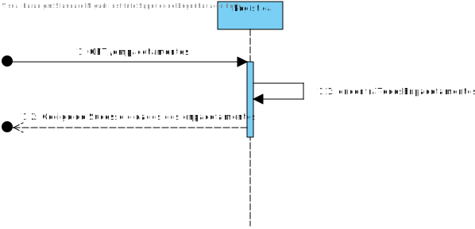

# UC005
=======================================

# 1. Requisitos

Serviço REST de dados mestre de logística que permita Criar, Listar e Editar empacotamentos.

### 1.1. Especificações e Clarificações do Cliente  

 **Encontradas no Caderno de Encargos:**
 
> O conceito de enpacotamento foi adicionado a meio deste sprint e por isso todas as informações foram obtidas através de clarificações do cliente.

 **De clarificações do Cliente:**
 
>**Pergunta:** "Ao analisar o Excel deste Sprint reparámos que foi introduzido o conceito de "empacotamento". Será que poderia esclarecer em concreto o seu significado, por favor?"
>
>**Resposta:** "O empacotamento tem a ver com a disposição das entregas no camião. (...) Um empacotamento de uma entrega assim consistirá na localização 3D da entrega no camião. Podem assumir uma grelha 3D correspondente ao volume da caixa de carga do camião igual para todos os camiões com as seguintes restrições:
0 < X < 10, 0 < Y < 20 e 0 < Z < 8, não é necessário validar se existem sobreposições fisicas entre os empacotamentos"

>**Pergunta:** "Para a criação do empacotamento é necessário a identificação de um camião ou de apenas de uma encomenda e a sua posição?"
>
>**Resposta:** "Um empacotamento corresponde a colocação de uma entrega num dado camião. Como já foi explicado um sistema externo calcularia a posição (x,y,z) onde a entrega deveria ser colocado.Devem também considerar neste conceito os tempos de colocação e retirada tal como referido no caderno de encargos"

### 1.2. Critérios de Aceitação

Neste caso de uso, os critérios de aceitação encontrados foram:

- Deve ser possível adicionar um enpacotamento a uma entrega
- Deve ser possível editar um enpacotamento já existente, tendo em conta:
	- Deve ser possivel listar todos os enpacotamentos
- Deve ser possível listar um enpacotamento já existente
- Um enpacotamento deve ter os seguintes dados:
	- Identificação da entrega
	- Coordenada X
	- Coordenada Y
	- Coordenada Z

# 2. Análise

Este UC faz uso dos seguintes agregados:
- Entrega
- Enpacotamento 

[(Domain Diagram)](../../Modelo_de_Dominio/DM.svg)

Como os dois agregados pertencem a diferentes partes do Sistema, enpacotamento pertence a Logística e entrega pertence à Gestão de Armazens, vai ser necessário utilizar o API desenvolvido em .NET, ou seja o API da Gestão de Armazéns, para obter a informação necessária.

# 3. Design

Em termos de design podemos ver que este UC está dividido em POST, GET e PUT, isto para ir de encontro com as especificações impostas pelo cliente, que já foram estudadas nos pontos anteriores.

## 3.1. Nível 1

### SSD - POST

### SSD - PUT

### SSD - GET

## 3.2. Nível 2

### SD - POST

### SD - PUT

### SD - GET

## 3.3. Nível 3

### SSD - POST

### SSD - PUT

### SSD - GET

### CD

## 3.4. Testes 

Dois tipos de Testes foram realizados

**Unitários**

Testes unitários para testar apenas as classes em questão, não havendo interações com outras classes, sendo usados duplos, maioritariamente studs, para fazer esse isolamento. Classes testadas aqui foram: value objects, agregate root, DTO e Mapper

Por exemplo (Teste feito no Controller):

	 it('3. Deve retornar um json com a informação do editar...', async function () {
        let req: Partial<Request> = {};
		req.body = {
            domainId: 1,
            coordenadaX: 3,
            coordenadaY: 5,
            coordenadaZ: 6,
        };

        let res: Partial<Response> = {
			json: sinon.spy()
        };

		let next: Partial<NextFunction> = () => {};

		sinon.stub(enpacotamentoServiceInstance, "editarEnpacotamento").returns( Result.ok<IEnpacotamentoDTO>( 
            {
                "domainId": req.body.domainId, 
                "entrega": "E01",
                "coordenadaX": 3,
                "coordenadaY": 5,
                "coordenadaZ": 6,
            }));

		const ctrl = new EnpacotamentoController(enpacotamentoServiceInstance as IEnpacotamentoService);

		await ctrl.editarEnpacotamento(<Request>req, <Response>res, <NextFunction>next);

		sinon.assert.calledOnce(res.json);
		sinon.assert.calledWith(res.json, sinon.match(
            {
                "domainId": req.body.domainId, 
                "entrega": "E01",
                "coordenadaX": 3,
                "coordenadaY": 5,
                "coordenadaZ": 6,
            }));

        enpacotamentoServiceInstance.editarEnpacotamento.restore();
	});

**Integração**

Testes aos controlers e servicos da User story.
São utilizados duplos para substituir os repositorios utilizados, para evitar o contacto com a base de dados e impedir que aconteçam erros provocados por coisas externas aos testes.

Por exemplo (Teste feito no Controller):

	it('3. Deve retornar um json com a informação do editar...', async function () {
        let req: Partial<Request> = {};
		req.body = {
            domainId: 1,
            coordenadaX: 3,
            coordenadaY: 5,
            coordenadaZ: 6,
        };

        let res: Partial<Response> = {
			json: sinon.spy()
        };

		let next: Partial<NextFunction> = () => {};

        sinon.stub(enpacotamentoRepoInstance, "findByDomainId").returns( enpacotamento );
        sinon.stub(enpacotamentoRepoInstance, "save").returns( null );

		const ctrl = new EnpacotamentoController(enpacotamentoServiceInstance as IEnpacotamentoService);

		await ctrl.editarEnpacotamento(<Request>req, <Response>res, <NextFunction>next);

		sinon.assert.calledOnce(res.json);
		sinon.assert.calledWith(res.json, sinon.match(
            {
                "domainId": req.body.domainId, 
                "entrega": "E01",
                "coordenadaX": 3,
                "coordenadaY": 5,
                "coordenadaZ": 6,
            }));
	});

