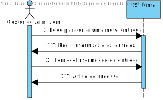
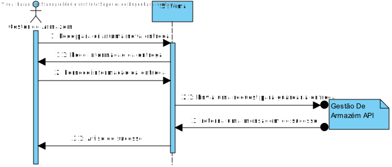
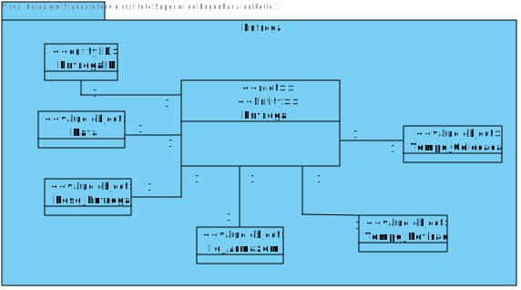
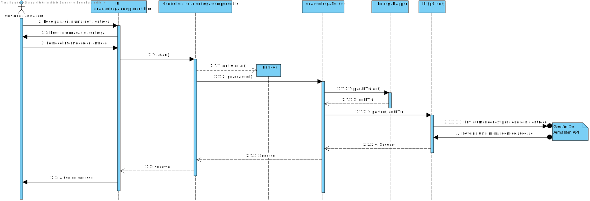
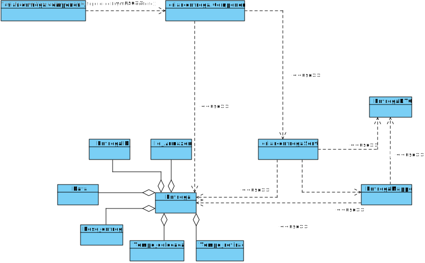

# US002
=======================================

# 1. Requisitos

Como gestor de armazém pretendo Criar uma Entrega

### 1.1. Especificações e Clarificações do Cliente  

 **Encontradas no Caderno de Encargos:**
 
>A informação que a empresa possui sobre as entregas são as seguintes:
>	- Identificador da entrega, ex., “220909/1”
>	- Data da Entrega (dia, mês, ano)
>	- Massa da entrega (em kg, associada ao peso dos produtos a entregar)
>	- Armazém para efetuar a entrega: identificador da loja
>	- Tempo para colocar uma entrega no camião (em minutos)
>	- Tempo para retirar a entrega do camião (em minutos)

 **De clarificações do Cliente:**
 
>**Pergunta:** "Pretende que Listemos sempre as Entregas todas ou poderemos querer listar por estados diferentes de Entregas?"
>
>**Resposta:** "bom dia, deve ser possivel filtrar as entregas pelo armazem a que se destinam e entre datas"

>**Pergunta:** "Quais as informações a que pretende visualizar depois de feito o pedido de listagem? Qual o formato que pretende visualizar - 
Exemplo: Ficheiro ou Dados numa página Web?"
>
>**Resposta:** "bom dia, deve ser possivel visualizar toda a informação das entregas para um dado dia com possibilidade de filtragem e ordenação por armazém. A visualização será efetuada na user interface a desenvolver no sprint B"

>**Pergunta:** No caso das entregas, pretende conseguir editar a informação de uma forma parcial (PATCH) ou de uma forma total (PUT)?
>
>**Resposta:** boa tarde, essa pergunta é sobre aspetos técnicos e não funcionais.
funcionalmente é necessário ter atenção a quais os dados que podem ser alterados ou não. por exemplo, não se pode alterar o identificador da entrega. No entanto o utilizador deve ser livre de escolher qua o subconjunto de dados que pretende alterar

### 1.2. Critérios de Aceitação

Neste caso de uso, os critérios de aceitação encontrados foram:

- Deve ser possivel Criar uma Entrega.
- A criação de uma Entrega tem de ser realizada atravez de uma interface grafica.
- A salvaguarda de dados tem de ser realizada atravez do API "Gestão de Armazens".

# 2. Análise

Este UC faz uso dos seguintes agregados:
- Entrega 

[(Domain Diagram)](../../Modelo_de_Dominio/DM.svg)

O agregado faz parte da area de Gestão de Armazens do projeto integrador pelo que a UC tera de conectar com o API de gestão de armazens.

# 3. Design

Este Use Case usa uma interface grafica produzida em typescript, usando angular framework e a libraria react como base.
Qualquer conecção com a base de dados tera de ser feita a partir do serviço REST

## 3.1. Nível 1

### SSD 

## 3.2. Nível 2

### SD 

## 3.3. Nível 3

## MD

### SSD - POST

### CD

## 3.4. Testes 

Dois tipos de Testes foram realizados

**Dominio**

Testes ao dominio da user storie EX: value objects, agregate root, DTO e Mapper

**Integraçao**

Testes aos controlers e servicos da User story.
É usado o mock da class de repositorio para testar a comunicação entre as componentes (Controllers,Serviços) do projeto.

