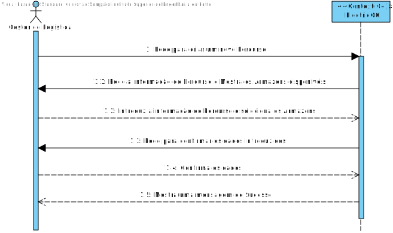
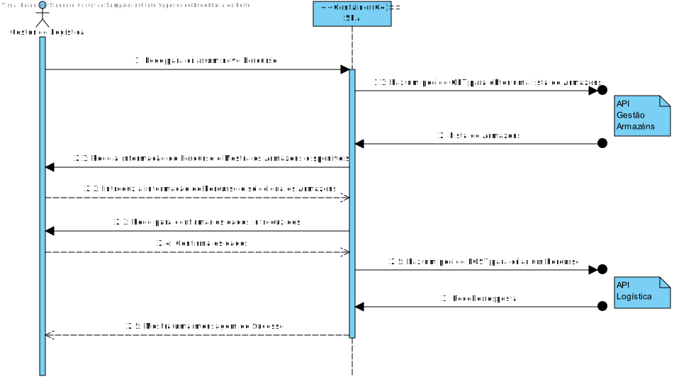
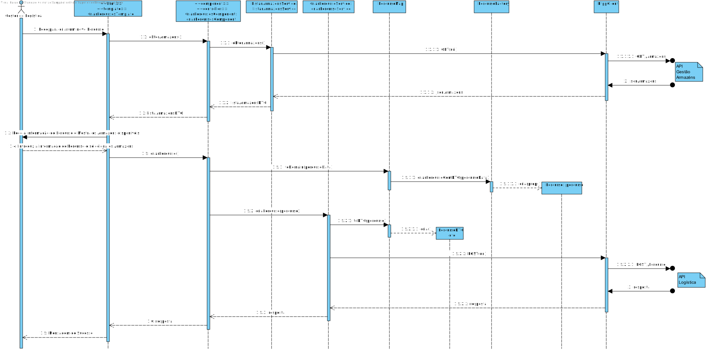
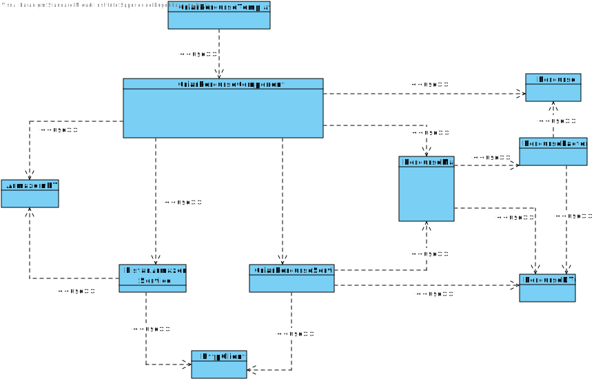

# US004
=======================================

# 1. Requisitos

Como gestor de logística pretendo Criar um Percurso entre dois armazéns.

### 1.1. Especificações e Clarificações do Cliente  

 **Encontradas no Caderno de Encargos:**
 
>A informação que a empresa possui sobre os melhores caminhos entre dois armazéns são os seguintes:
>	- Identificação do armazém de partida
>	- Identificação do armazém de chegada
>	- Distância (em km)
>	- Tempo (em minutos) para percorrer a distância com o camião completamente cheio, ou seja, com a carga de 4,3 toneladas
>	- Energia gasta da bateria para percorrer essa distância com o camião completamente cheio (em kWh)
>	- Tempo extra se for necessário um carregamento extra da bateria (este dado é apenas diferente de 0 quando a carga das baterias a 80% feita previamente não é suficiente para percorrer completamente o troço, como por exemplo para um camião que carrega 4,3 toneladas e que tem de ir da Póvoa do Varzim para Arouca)

 **De clarificações do Cliente:**
 
>**Pergunta:** "É possível existir mais do que um percurso com os mesmos identficadores de armazém de partida e chegada?"
>
>**Resposta:** "Do ponto de vista do módulo de Planeamento só estamos a considerar um percurso em cada sentido entre os armazéns, assume-se que é o melhor percurso entre esses armazéns. Notar que o percurso entre o armazém A e o armazém B é diferente do percurso entre o armazém B e o A, podendo envolver distâncias, tempos e consumos energéticos diferentes ao serem percorridos."

>**Pergunta:** Caro cliente, ao criar um novo caminho, deseja que seja possível escolher de entre os armazéns existentes através de uma lista, ou prefere o uso de caixas de texto e assim escrever o seu identificador ou descrição?
>
>**Resposta:** Preferencialmente um controlo dropdown com  auto-complete. em alternativa um controlo drop down simples  .

### 1.2. Critérios de Aceitação

Neste caso de uso, os critérios de aceitação encontrados foram:

- Deve ser possível Criar um Percurso novo
- Um percurso deve ter os seguintes dados:
	- Identificação do armazém de partida
	- Identificação do armazém de chegada
	- Distância (em km)
	- Tempo (em minutos) para percorrer a distância com o camião completamente cheio, ou seja, com a carga de 4,3 toneladas
	- Energia gasta da bateria para percorrer essa distância com o camião completamente cheio (em kWh)
	- Tempo extra se for necessário um carregamento extra da bateria
- Ao criar um percurso a escolha dos armazens deve ser:
    - ou a partir de um controlo dropdown com auto-complete (preferivel)
    - ou com um controlo dropdown simples

# 2. Análise

Este UC faz uso dos seguintes agregados:
- Percurso
- Armazém 

[(Domain Diagram)](../../Modelo_de_Dominio/DM.svg)

Devido a ambos os agregados pertencerem a partes diferentes do sistema será necessário o uso de duas API desenvolvidas anteriormente, primeiramente o API da gestão de Armazens (.NET) onde vai ser possível ir buscar a informação dos Armazens existentes, nomeadamente os identificadores dos armazens, e em segundo lugar faremos uso do API da Logística (nodejs) para persistir os dados do novo percurso na Base de Dados MongoDB.H

# 3. Design

## 3.1. Nível 1

### SSD

## 3.2. Nível 2

### SD

## 3.3. Nível 3

### SD

### CD

## 3.4. Testes 

**Testes Unitários**

| | | |
| --- | --- | --- |
| **Módulo:** | SPA |
| **Objetivo:** | Testar os componentes do SPA usados para Criar Percursos |
| **Método de teste:** | Automático |
| **Cenário** | **Teste** | **Resultado Esperado** |
|  |  |  |

**Testes End-to-End**

| | | |
| --- | --- | --- |
| **Módulo:** | SPA |
| **Objetivo:** | Testar se a componente de Criar Percursos funciona com o resto do Sistema  |
| **Método de teste:** | Automático |
| **Cenário** | **Teste** | **Resultado Esperado** |
|  |  |  |

# 4. Observações

