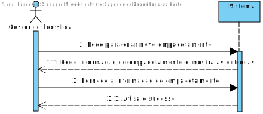
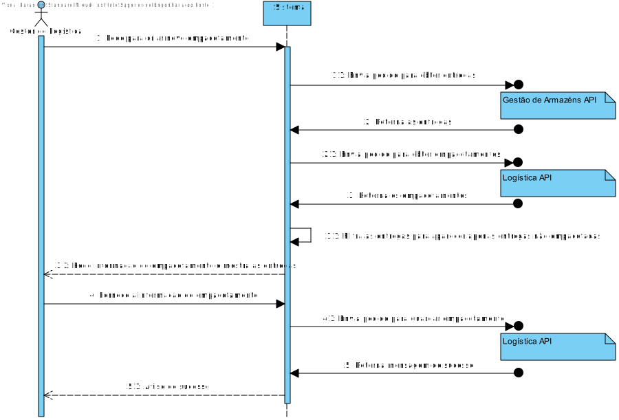
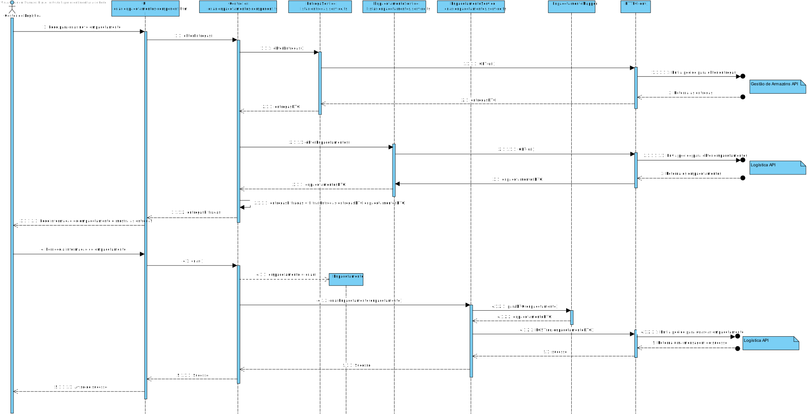
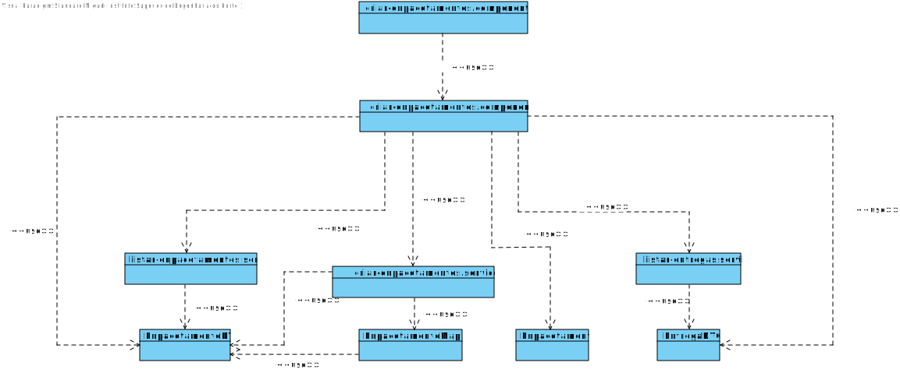

# US005
=======================================

# 1. Requisitos

Como gestor de logística pretendo Criar um Empacotamento

### 1.1. Especificações e Clarificações do Cliente  

**De clarificações do Cliente:**

>**Pergunta:** "Quando o utilizador está a pesquisar por uma entrega para fazer o empacotamento, devem aparecer entregas que já tenham empacotamentos ou que tenham datas de entrega no passado?"
>
>**Resposta:** "Ao criar um empacotamento apenas deve ser possivel escolher entregas que ainda não "tenham sido empacotadas""

### 1.2. Critérios de Aceitação

Neste caso de uso, os critérios de aceitação encontrados foram:

- Deve ser possivel criar um empacotamento.
- A criação de um empacotamento tem de ser realizada através de uma interface grafica.
- A salvaguarda de dados tem de ser realizada através do API "Logística".

# 2. Análise

Este UC faz uso dos seguintes agregados:
- Empacotamento
- Camião
- Entrega

[(Domain Diagram)](../../Modelo_de_Dominio/DM.svg)

O agregado de Empacotamento e Entrega faz parte da área de Lógistica e a entrega faz parte da área de Gestão de Armazéns pelo que a UC tere de conectar com ambas as API's

# 3. Design

Esta US usa uma interface gráfica produzida em TypeScript, usando angular framework.
Qualquer conexão com a base de dados terá de ser feita a partir do serviço REST

*Para além das secções sugeridas, podem ser incluídas outras.*

## 3.1. Nível 1

### SSD 

## 3.2. Nível 2

### SD 

## 3.3. Nível 3

### SD

### CD

## 3.4. Testes 
*Nesta secção deve sistematizar como os testes foram concebidos para permitir uma correta aferição da satisfação dos requisitos.*

**Teste 1:** Verificar que é possível queria um empacotamento

	it('Deve criar Empacotamento', function() {
    
    cy.intercept(
      {
        method: 'POST',
        url: 'http://localhost:3000/api/Enpacotamentos',
       },
       [] )

    cy.get("#domainId").clear().type("9999999");
    cy.get("select").select("4398");
    cy.get("#matricula").clear().type("CA-10-10");
    cy.get("#tempoColocacao").clear().type("20");
    cy.get("#tempoRetirada").clear().type("30");
    cy.get("#coordenadaX").clear().type("4");
    cy.get("#coordenadaY").clear().type("2");
    cy.get("#coordenadaZ").clear().type("1");

    cy.get("button").click();

    cy.get("h1").should("have.text", " Enpacotamento Guardado ");
  })

**Teste 2:** Verificar que é impossível criar emapacotamento com ID inválido

  it('Deve avisar erro com ID inválido', function() {
    cy.get("#domainId").clear().type("-10");
    cy.get("#domainId").blur();
    cy.get(".error").should("have.text", " O identificador tem de ser um número positivo ");
  })
