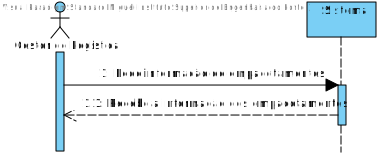

# US006
=======================================

# 1. Requisitos

Como gestor de logística pretendo listar os empacotamentos

### 1.1. Critérios de Aceitação

Neste caso de uso, os critérios de aceitação encontrados foram:

- Deve ser possivel visualizar a informação de todos as Empacotamentos.
- A visualização de empacotamentos tem de ser realizada através de uma interface grafica.
- A informação dos empacotamentos tem de ser obtida atravez do API "Logística".

# 2. Análise

Este UC faz uso dos seguintes agregados:
- Empacotamento
- Camião
- Entrega

[(Domain Diagram)](../../Modelo_de_Dominio/DM.svg)

O agregado de Empacotamento e Entrega faz parte da área de Lógistica e a entrega faz parte da área de Gestão de Armazéns pelo que a UC tere de conectar com ambas as API's

# 3. Design

Esta US usa uma interface gráfica produzida em TypeScript, usando angular framework.
Qualquer conexão com a base de dados terá de ser feita a partir do serviço REST

*Para além das secções sugeridas, podem ser incluídas outras.*

## 3.1. Nível 1

### SSD 

## 3.2. Nível 2

### SD 

## 3.3. Nível 3

### SD

### CD

## 3.4. Testes 
*Nesta secção deve sistematizar como os testes foram concebidos para permitir uma correta aferição da satisfação dos requisitos.*

**Teste 1:** Verificar se os enpacotamentos são listados

it('Deve listar todos os enpacotamentos disponiveis', function(){
    cy.get('table').find('tr').its('length').should('be.gte', 1);
  })

**Teste 2:** Verificar que a filtragem por ID funciona

 it('Deve listar apenas o enpacotamento escolhido por ID', () => {
    cy.get("#id").type("-1");
    cy.get('table').find('tr').should('have.length', 2)
  })

**Teste 3:** Verificar que a filtragem por Entrega funciona

  it('Deve listar apenas o enpacotamento escolhido por Entrega', () => {
    cy.get("#entrega").type("TEST");
    cy.get('table').find('tr').should('have.length', 2)
  })
