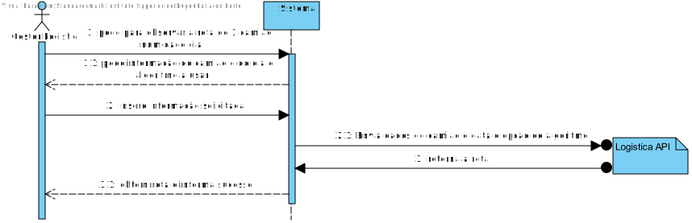

# US008
=======================================

# 1. Requisitos

Como gestor de logística pretendo obter o Planeamento da rota para 1 camião e 1 dado dia

### 1.1. Especificações e Clarificações do Cliente

>O planeamento tem as seguintes caraterísticas:
>- Camiao ID 
>- Data
>- Número do algoritmo 

**De clarificações do Cliente:**

>**Pergunta** "Para obter o planeamento de 1 camião num dado dia, qual é a heuristica que se deve utilizar? Deve ser algo que o utilizador final pode escolher?"
>
>**Resposta** "Se implementaram várias heuristicas, o utilizador deve poder escolher qual a heuristica a utilizar"

### 1.2. Critérios de Aceitação

Neste caso de uso, os critérios de aceitação encontrados foram:

- O id do camiao tem de existir na base de dados
- Data que irá ser usada para obter a rota
- Número que especifica a heurística a ser usada

# 2. Design

## 2.1. Nível 1

### SSD

## 2.2. Nível 2

### SD

## 2.3. Nível 3

### SD

### CD

## 2.4. Testes

Dois tipos de Testes foram realizados

**Integraçao**

Testes aos controlers e servicos da User story.
É usado o mock da class de repositorio para testar eficientemente

# 3. Observações

