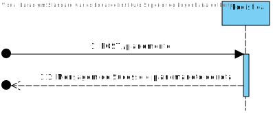
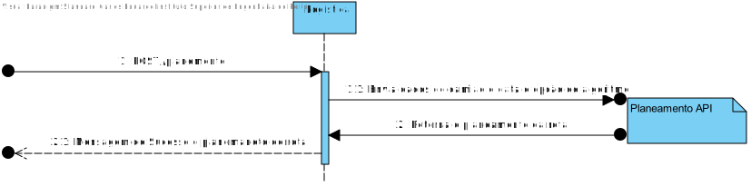
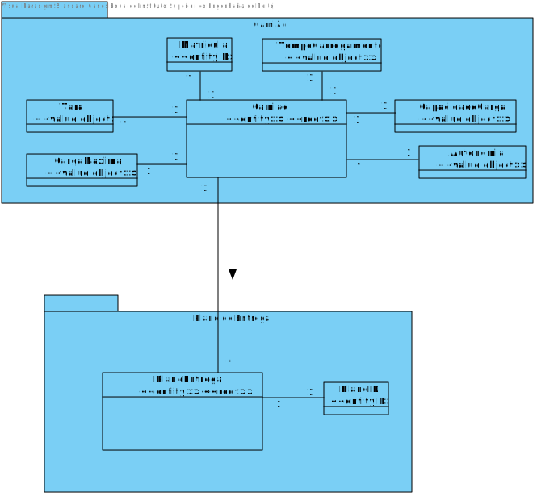
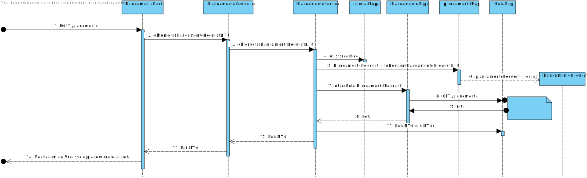
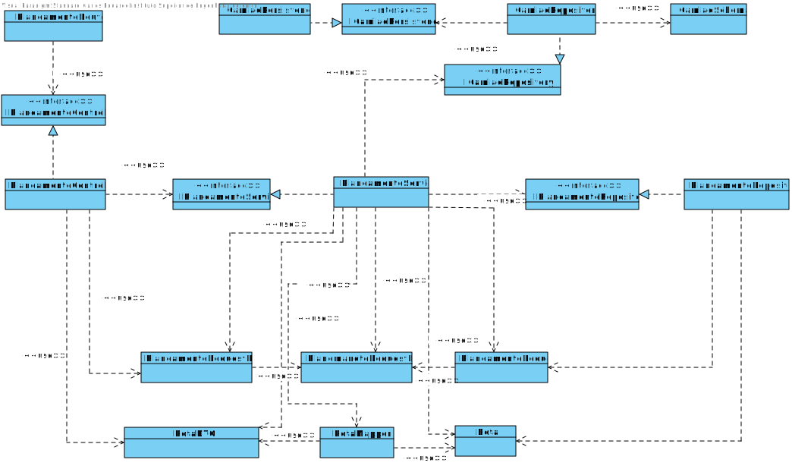

# US012
=======================================

# 1. Requisitos

Como gestor de logística pretendo efetuar o Planeamento de rota para 1 camião e 1 dado dia

### 1.1. Especificações e Clarificações do Cliente  

 **Encontradas no Caderno de Encargos:**
 
 Como pode ser visto no caderno de encargos o planeamento é realizado pelo modulo "planeamento"

 **De clarificações do Cliente:**
 
>**Pergunta:** "Nas UCs pertencentes ao 3.2.3, é dito "Recebendo os dados das entregas a fazer por 1 camião e dos troços entre armazéns". De que modo pretende que estas informações sejam transmitidas ao módulo do planeamento?"
>
>**Resposta:** "essa é uma decisão técnica na equipa. o importante é que a informação circule entre os componentes para garantir que todos so componentes conhecem o mesmo "estado" do sistema. ou seja se o módulo de gestão de armazens conhece o armazem A e B. o módulo de visualização também conhece o armazem A e B, e o módulo de planeamento também conhece o A e o B. se for adicionado um armazem C, todos os módulos o ficam a conhecer. "

>**Pergunta:** "Para obter o planeamento de 1 camião num dado dia, qual é a heuristica que se deve utilizar? Deve ser algo que o utilizador final pode escolher?"
>
>**Resposta:** "se implementaram várias heuristicas, o utilizador deve poder escolher qual a heuristica a utilizar (ex., dropdown)."

### 1.2. Critérios de Aceitação

Neste caso de uso, os critérios de aceitação encontrados foram:

- Deve ser possivel obter o planemaento de um camião para um dado dia
- Deve fornecer uma interface Rest para receber o pedido recebendo a informação do camião e o dia
- O calculo do planemaneto deve ser feito atravez de um pedido ao modulo planemaneto
- Deve ser possivel escolher o algoritmo a ser usado

# 2. Análise

Este UC faz uso dos seguintes agregados:
- Camiao
- Planeamento

[(Domain Diagram)](../../Modelo_de_Dominio/DM.svg)

O agregado faz parte da area de Logitica do projeto integrador pelo que a UC tera de utilizar a base de dados mongodb

adicionalmento carios algoritmos devem ser suportados, como o servidor do planeamento suporta get request com parametros no url a opção selecionada foi criar variações do url para escolher a opção sendo cada algoritmo atribuido um numero:

- Todos os caminhos = 1
- Peso da entrega = 2
- Tempo de viagem = 3
- Peso por tempo de viagem = 4

# 3. Design

Esta US usa uma interface grafica produzida em typescript oferecendo a interface do API usando o Node.js.

## 3.1. Nível 1

### SSD 

## 3.2. Nível 2

### SD 

## 3.3. Nível 3

## MD

### SD

### CD

## 3.4. Testes 

Dois tipos de Testes foram realizados

**Dominio**

Testes ao dominio da user storie EX: value objects, agregate root, DTO e Mapper

**Integraçao**

Testes aos controlers e servicos da User story.
É usado o mock da class de repositorio para testar eficientemente

