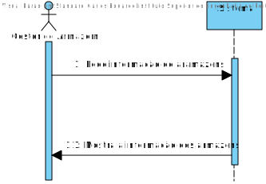
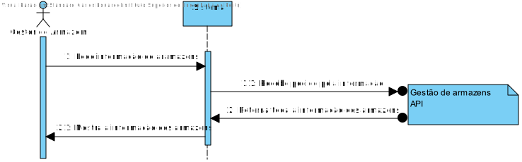
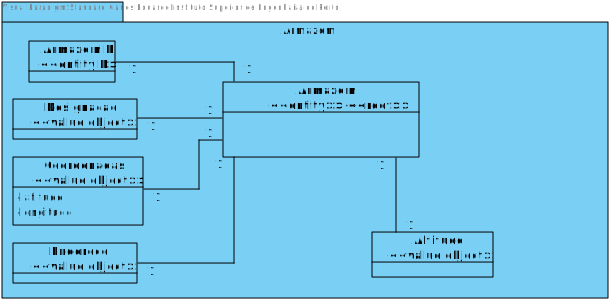
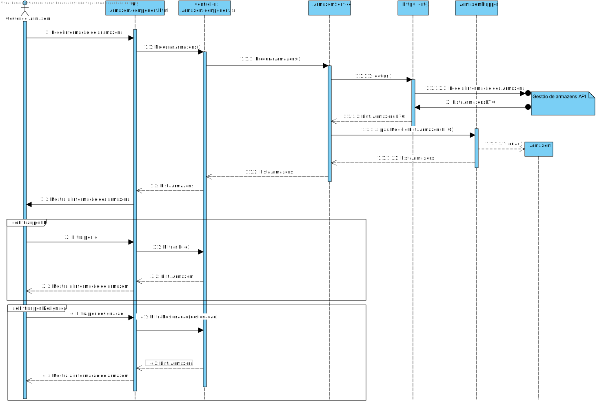
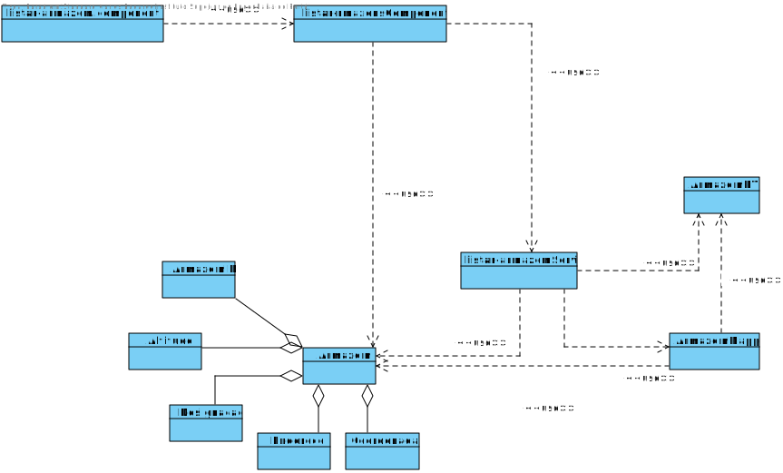

# US001
=======================================

# 1. Requisitos

Como gestor de armazém pretendo Criar um Armazém

### 1.1. Especificações e Clarificações do Cliente  

 **De clarificações do Cliente:**
 

>**Pergunta:** "Porque atributos gostaria que a filtragem dos armazéns fosse feita?"
>
>**Resposta:** "Pelo seu identificador e designação."

### 1.2. Critérios de Aceitação

Neste caso de uso, os critérios de aceitação encontrados foram:

- Deve ser possivel visualizar a informação de todos os Armazens.
- A visualização dos armazens tem de ser feitas a partir de um UI gráfico.
- A informação dos armazens tem de ser obtida atravez do API "Gestão de Armzazens".
- Deve ser possivel filtrar a lista de armzaens pelo identificador e pela designacao.

# 2. Análise

Este UC faz uso dos seguintes agregados:
- Armazém 

[(Domain Diagram)](../../Modelo_de_Dominio/DM.svg)

O agregdo faz parte da area de Gestão do projeto integrador pelo que a UC tera de conectar com o API de gestão de armazens

# 3. Design

Esta US usa uma interface grafica produzida em typescript, usando angular framework e a libraria react como base.
Qualquer conecção com a base de dados tera de ser feita a partir do serviço REST

## 3.1. Nível 1

### SSD 

## 3.2. Nível 2

### SD 

## 3.3. Nível 3

## MD

### SSD - POST

### CD

## 3.4. Testes 

Dois tipos de Testes foram realizados

**Dominio**

Testes ao dominio da user storie EX: value objects, agregate root, DTO e Mapper

**Integraçao**

Testes aos controlers e servicos da User story.
É usado o mock da class de repositorio para testar eficientemente

