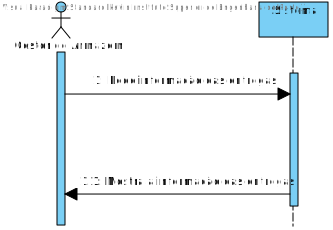
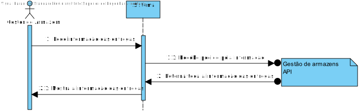
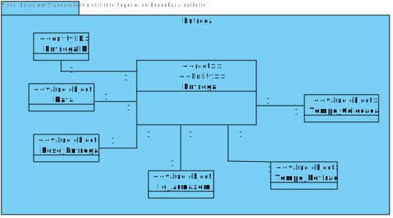
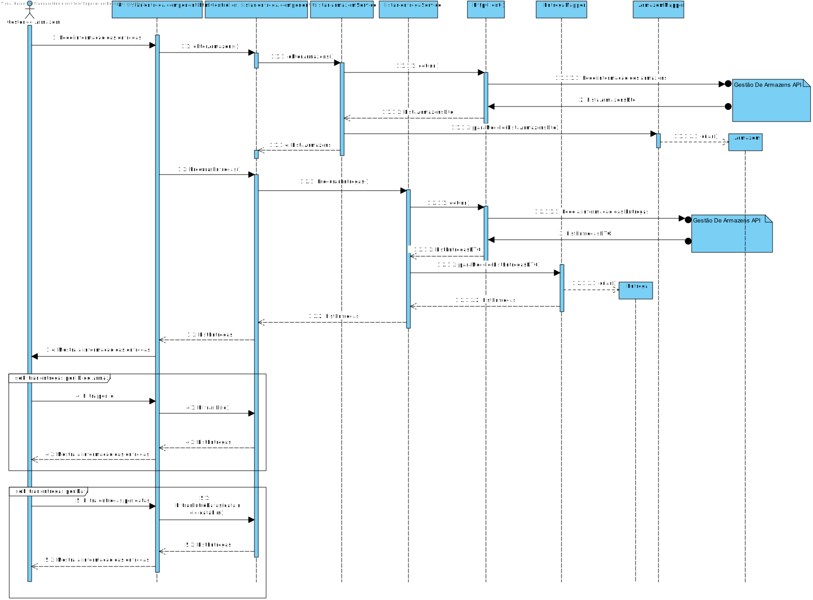
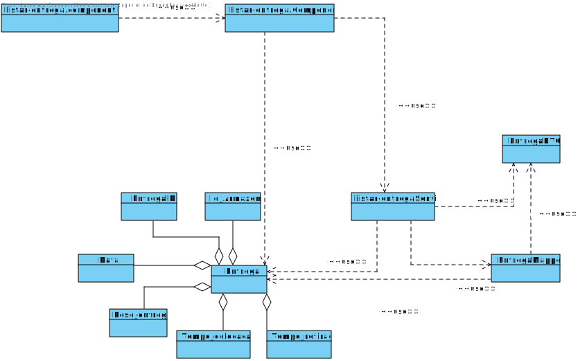

# US021
=======================================

# 1. Requisitos

Como gestor de armazém pretendo listar as Entregas

### 1.1. Especificações e Clarificações do Cliente  

 **De clarificações do Cliente:**

 >**Pergunta:** "Pretende que Listemos sempre as Entregas todas ou poderemos querer listar por estados diferentes de Entregas?"
>
>**Resposta:** "bom dia, deve ser possivel filtrar as entregas pelo armazem a que se destinam e entre datas"

>**Pergunta:** "Quais as informações a que pretende visualizar depois de feito o pedido de listagem? Qual o formato que pretende visualizar - 
Exemplo: Ficheiro ou Dados numa página Web?"
>
>**Resposta:** "bom dia, deve ser possivel visualizar toda a informação das entregas para um dado dia com possibilidade de filtragem e ordenação por armazém. A visualização será efetuada na user interface a desenvolver no sprint B"

### 1.2. Critérios de Aceitação

Neste caso de uso, os critérios de aceitação encontrados foram:

- Deve ser possivel visualizar a informação de todas as Entregas.
- A visualização das Entregas tem de ser feitas a partir de um UI gráfico.
- A informação das Entregas tem de ser obtida atravez do API "Gestão de Armzazens".
- Deve ser possivel filtrar a lista das Entregas pelo identificador do Armazém e entre datas.

# 2. Análise

Este UC faz uso dos seguintes agregados:
- Entrega

[(Domain Diagram)](../../Modelo_de_Dominio/DM.svg)

O agregado faz parte da area de Gestão de armazens do projeto integrador pelo que a UC tera de conectar com o API de gestão de armazens

# 3. Design

Esta US usa uma interface grafica produzida em typescript, usando angular framework e a libraria react como base.
Qualquer conecção com a base de dados tera de ser feita a partir do serviço REST

## 3.1. Nível 1

### SSD 

## 3.2. Nível 2

### SD 

## 3.3. Nível 3

## MD

### SSD - POST

### CD

## 3.4. Testes 

Dois tipos de Testes foram realizados

**Dominio**

Testes ao dominio da user storie EX: value objects, agregate root, DTO e Mapper

**Integraçao**

Testes aos controlers e servicos da User story.
É usado o mock da class de repositorio para testar a comunicação entre as componentes (Controllers,Serviços) do projeto.

