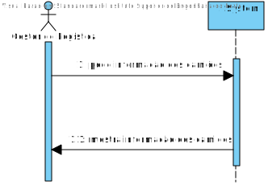
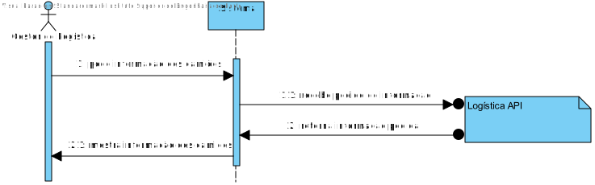
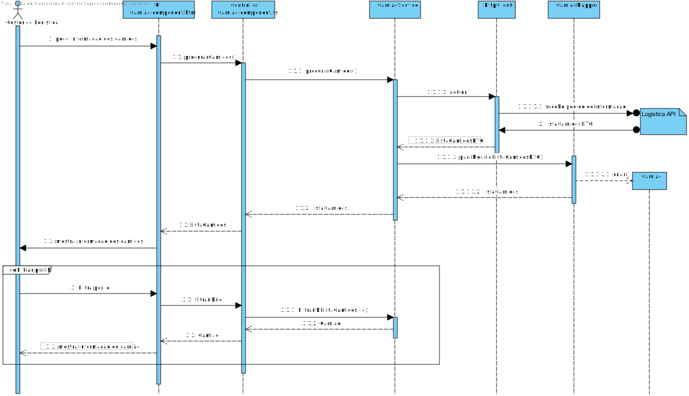
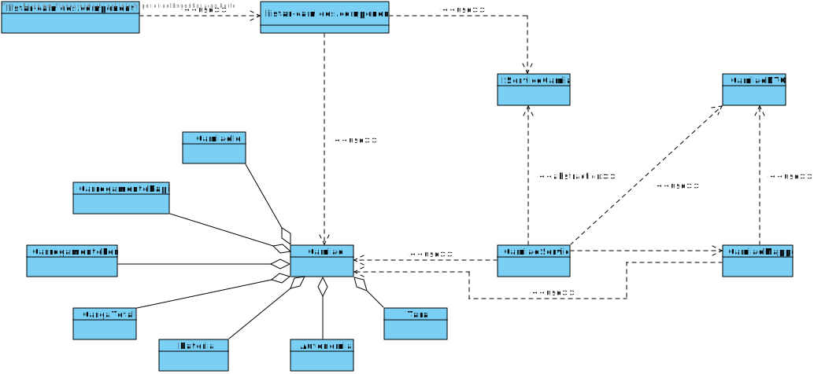

# US022
=======================================

# 1. Requisitos

Como Gestor de Logística, pretendo listar Camiões

### 1.1. Especificações e Clarificações do Cliente

**Encontradas no Caderno de Encargos:**

>Os camiões elétricos têm as seguintes caraterísticas:
>- Tara (peso do camião sem carga, ou seja, vazio): ex., 7,5 toneladas
>- Capacidade de Carga (a massa que pode ser transportada no camião): ex., 4,3 toneladas
>- Carga máxima do conjunto de baterias elétricas do camião (energia acumulada nas
   baterias): ex., 80 kWh (quilo watt hora)
>- Autonomia do camião com toda a capacidade de carga (ex., 4,3 toneladas) e com as
   baterias elétricas completamente carregadas: ex., 100 km
>- Tempo de carregamento rápido das baterias do camião (para carregar as baterias desde
   o mínimo de carga elétrica recomendado, 20%, até um valor padrão de 80%): ex., 1 hora

### 1.2. Critérios de Aceitação

Neste caso de uso, os critérios de aceitação encontrados foram:

- Deve ser possível Criar um Camiao novo
- Deve ser possível Editar um Camiao já existente, tendo em conta:
    - Deve ser possivel listar todos os camioes
    - Não pode ser possível alterar a matricula de um camiao ja criado
    - É possivel alterar um subconjunto de atributos
- Deve ser possível Listar um Camiao já existente
- Um camiao deve ter os seguintes dados:
    - Identificação do camiao (matricula)
    - Peso da tara
    - Capacidade maxima de carga (massa total que o camiao consegue transportar)
    - Carga máxima das baterias
    - Autonomia do camiao
    - Tempo de carregamento rapido
    - Tempo de carregamento lento

# 2. Análise

Este UC faz uso dos seguintes agregados:
- Camião

[(Domain Diagram)](../../Modelo_de_Dominio/DM.svg)

No entanto, devido à grande quantidade de percursos existentes na base de dados e para permitir uma melhor escalabidade, é necessário ter em conta que o API Logística não deve retornar todos os Percursos num único pedido GET, mas assim apenas parte deles de cada vez, assim vai ser preciso desenvolver uma nova funcionalidade para o API que permita que isso seja possivel. Neste caso a equipa decidiu que fazer pedidos GET de 30 Percursos de cada vez seria o suficiente para o pretendido.

# 3. Design

## 3.1. Nível 1

### SSD

## 3.2. Nível 2

### SD

## 3.3. Nível 3

### SD

### CD

## 3.4. Testes

Dois tipos de Testes foram realizados

**Dominio**

Testes ao dominio da user storie EX: value objects, agregate root, DTO e Mapper

**Integraçao**

Testes aos controlers e servicos da User story.
É usado o mock da class de repositorio para testar eficientemente

# 4. Observações