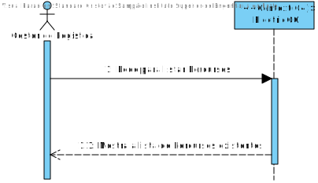
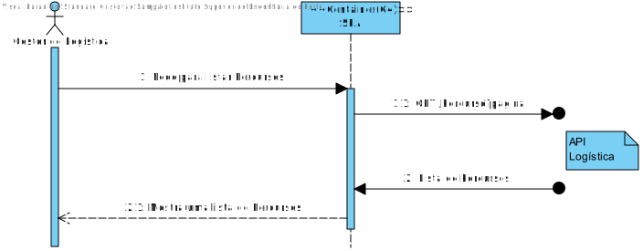
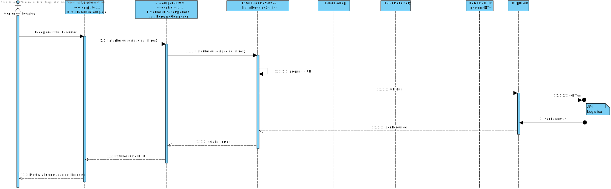
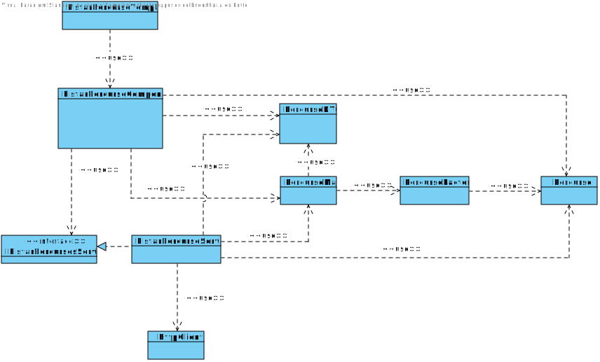

# US023
=======================================

# 1. Requisitos

Como gestor de logística pretendo Listar Percursos.

### 1.1. Especificações e Clarificações do Cliente  

 **Encontradas no Caderno de Encargos:**
 
>A informação que a empresa possui sobre os melhores caminhos entre dois armazéns são os seguintes:
>	- Identificação do armazém de partida
>	- Identificação do armazém de chegada
>	- Distância (em km)
>	- Tempo (em minutos) para percorrer a distância com o camião completamente cheio, ou seja, com a carga de 4,3 toneladas
>	- Energia gasta da bateria para percorrer essa distância com o camião completamente cheio (em kWh)
>	- Tempo extra se for necessário um carregamento extra da bateria (este dado é apenas diferente de 0 quando a carga das baterias a 80% feita previamente não é suficiente para percorrer completamente o troço, como por exemplo para um camião que carrega 4,3 toneladas e que tem de ir da Póvoa do Varzim para Arouca)

 **De clarificações do Cliente:**

>**Pergunta:** O que é pretendido quanto à listagem?
>
>Listar só um percurso, ou listar os percursos de acordo com uma determinda filtragem e ordem?
>
>Caso seja pretendida a segunda opção, deseja que seja ordenado e filtrado por que tipo de informação?
>
>**Resposta:** Deve ser possivel listar todos os percursos, podendo efetuar pesquisas/filtros sobre os mesmos, nomeadamente sobre o armazem origem e/ou armazem destino.

### 1.2. Critérios de Aceitação

Neste caso de uso, os critérios de aceitação encontrados foram:

- Deve ser possível Listar um Percurso já existente
- Deve ser possível aplicar filtros (nomeadamente sobre o armazem de origem e/ou armazem destino)
- Um percurso deve ter os seguintes dados:
	- Identificação do armazém de partida
	- Identificação do armazém de chegada
	- Distância (em km)
	- Tempo (em minutos) para percorrer a distância com o camião completamente cheio, ou seja, com a carga de 4,3 toneladas
	- Energia gasta da bateria para percorrer essa distância com o camião completamente cheio (em kWh)
	- Tempo extra se for necessário um carregamento extra da bateria

# 2. Análise

Este UC faz uso dos seguintes agregados:
- Percurso

[(Domain Diagram)](../../Modelo_de_Dominio/DM.svg)

Como apenas utilizamos o Agregado de Percursos nesta US, então o desenvolvimento desta US é relativamente simples, podendo limitar-nos simplesmente ao uso da API de Logística (nodejs).

No entanto, devido à grande quantidade de percursos existentes na base de dados e para permitir uma melhor escalabidade, é necessário ter em conta que o API Logística não deve retornar todos os Percursos num único pedido GET, mas assim apenas parte deles de cada vez, assim vai ser preciso desenvolver uma nova funcionalidade para o API que permita que isso seja possivel. Neste caso a equipa decidiu que fazer pedidos GET de 30 Percursos de cada vez seria o suficiente para o pretendido.

# 3. Design

## 3.1. Nível 1

### SSD

## 3.2. Nível 2

### SD

## 3.3. Nível 3

### SD

### CD

## 3.4. Testes 

**Testes Unitários**

| | | |
| --- | --- | --- |
| **Módulo:** | SPA |
| **Objetivo:** | Testar os componentes do SPA usados para Criar Percursos |
| **Método de teste:** | Automático |
| **Cenário** | **Teste** | **Resultado Esperado** |
|  |  |  |

**Testes End-to-End**

| | | |
| --- | --- | --- |
| **Módulo:** | SPA |
| **Objetivo:** | Testar se a componente de Criar Percursos funciona com o resto do Sistema  |
| **Método de teste:** | Automático |
| **Cenário** | **Teste** | **Resultado Esperado** |
|  |  |  |

# 4. Observações