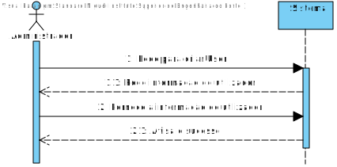
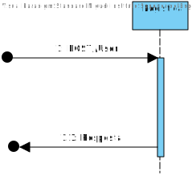
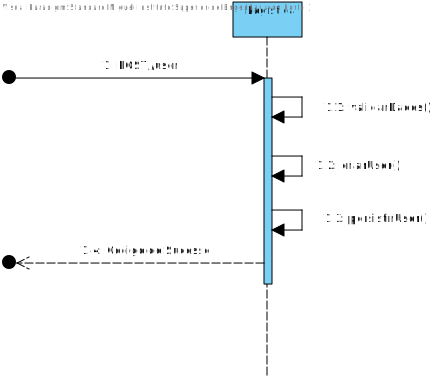
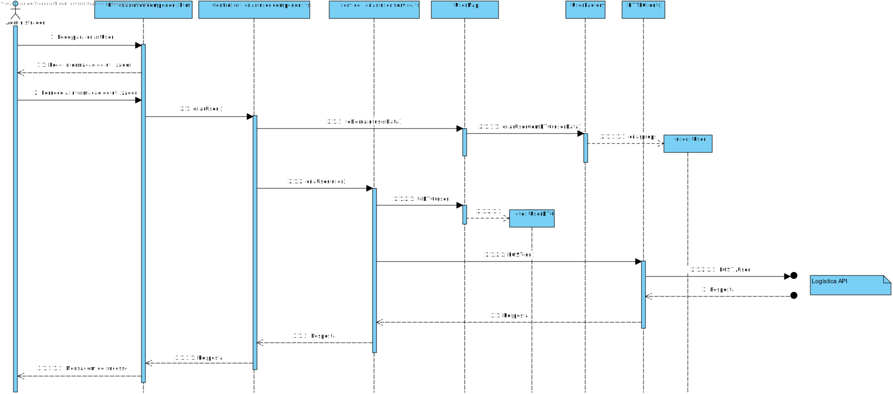
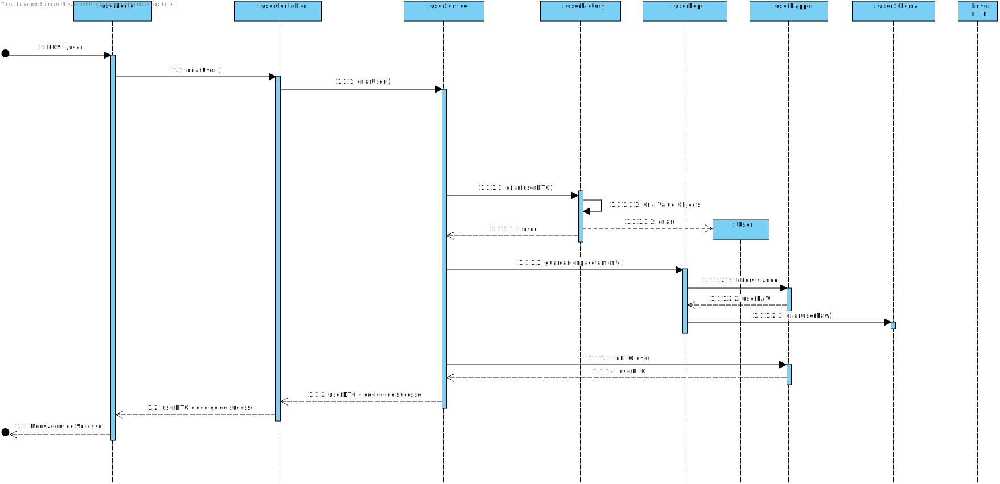
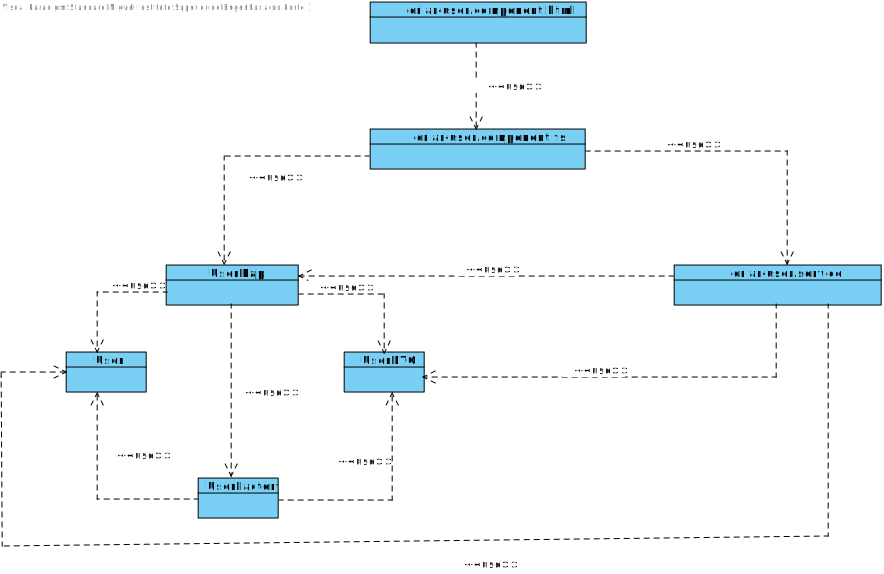
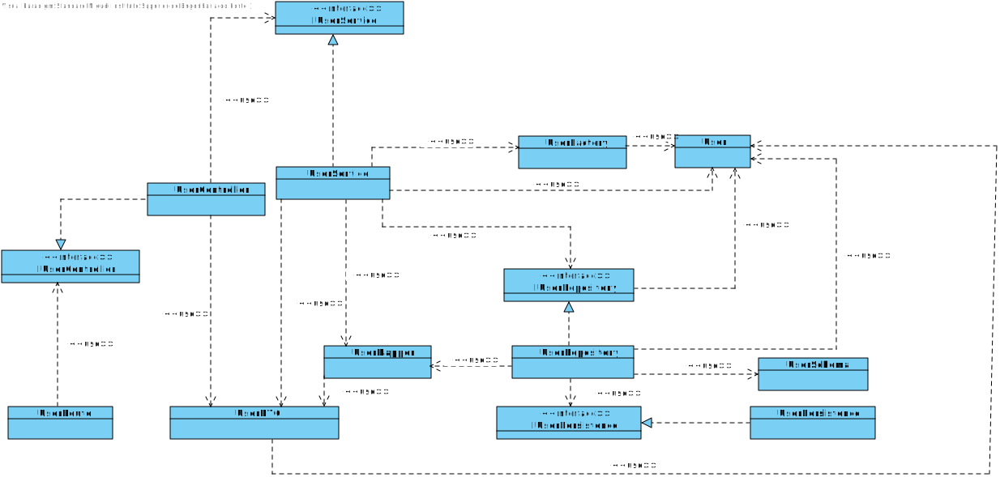

# US024
=======================================

# 1. Requisitos

Como administrador pretendo criar uma conta de utilizador

### 1.1. Especificações e Clarificações do Cliente

**De Clarificações do Cliente:**

 >**Pergunta:** "Na criação do utilizador, será o administrador a colocar a palavra-passe ou a sua definição será feita de outra forma, se sim de que forma?"
>
>**Resposta:** "Supondo que estão a utilizar SSO irão "reutilizar" uma conta do prestador de serviços de autenticação pelo que não será necessário introduzir a password. Se não usarem SSO devem permtir que o administrador introduza a password inicial, mas o utilizador deve altera-la no primeiro login."

>**Pergunta:** "Seria possível identificar quais os tipos de utilizadores necessários e aquilo que estes teriam acesso? Sem ser o administrador que esse acho que já é claro."
>
>**Resposta:** "Os tipos de utilizador estão identificados nas user stories, ex., "como gestor de logistica pretendo ..."

# 2. Análise

Este UC faz uso dos seguintes agregados:
- User

# 3. Design

## 3.1. Nível 1

### SD - SPA 

### SD - LOGÍSTICA 

## 3.2. Nível 2

### SSD - SPA

### SSD - LOGÍSTICA 

## 3.3. Nível 3

### SD - SPA

### SD - LOGÍSTICA 

)

### CD - SPA

### CD - LOGÍSTICA 

## 3.4. Testes

Foram realizados testes de integração e unitários quer ao serviço quer à componente

