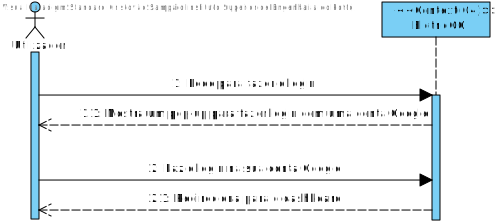
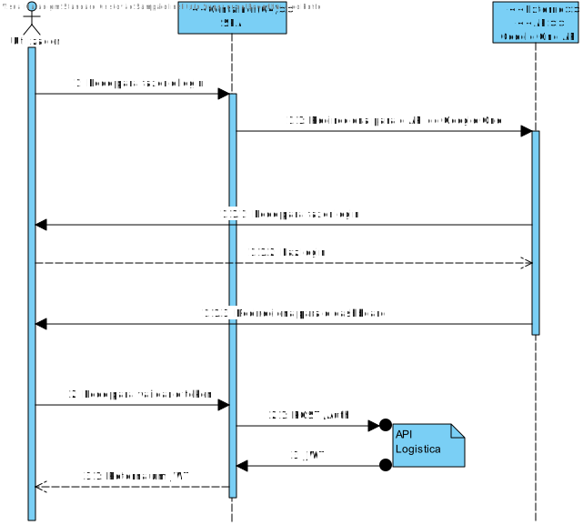
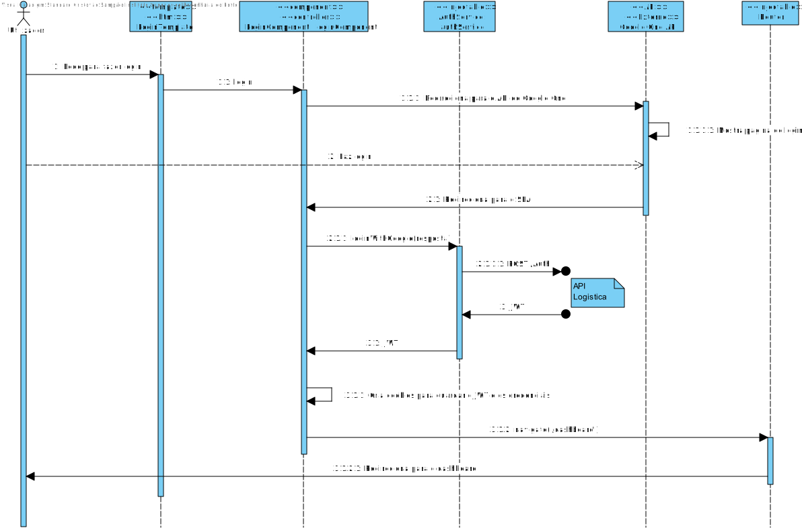
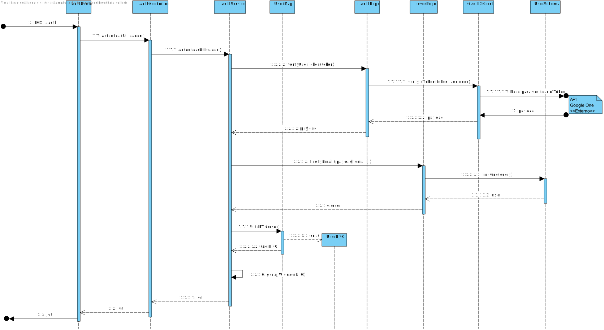

# US026
=======================================

# 1. Requisitos

Como utilizador pretendo autenticar-me na aplicação via SSO (e.g. AzureAD, Google, Facebook)

### 1.1. Especificações e Clarificações do Cliente  

 **Encontradas no Caderno de Encargos:**
 
 *Não foi encontrada informação relevante em relação a esta User Story*

 **De clarificações do Cliente:**

> ***[Pergunta:](https://moodle.isep.ipp.pt/mod/forum/discuss.php?d=19976)*** 
>Após analisarmos o que é pretendido nesta funcionalidade ficamos na dúvida de quantos e quais provedores de identidade externas pretende
> ter disponível.
> 
>É apenas o Azure AD? Apenas o Google? Uma combinação dos exemplos dados?
>
> ***Resposta:*** Basta um fornecedor. podem escolher livremente qual.

### 1.2. Critérios de Aceitação

Nesta User Story, os critérios de aceitação encontrados foram:

- Deve ser implementado um sistema de SSO
- Apenas é preciso um fornecedor

# 2. Análise

Aqui o único objetivo é que seja possivel autenticar um utilizador a partir de um sistema SSO, existem diversos fornecedores que podemos usar mas neste caso foi optado usar o Google One como fornecedor devido a ser dos mais simples de utilizar (conclusão tirada após alguma pesquisa) e por ser um dos mais reconhecidos e seguros.

Para além disso é preciso ter em conta que é necessário gerar um Jwt para depois o utilizador poder fazer pedidos às API, porque ao implementar o SSO é necessário que as API também passem a utilizar a autenticação para impedir que sejam feitos pedidos de utilizadores não autenticados no sistema.

# 3. Design

## 3.1. Nível 1

### SSD

## 3.2. Nível 2

### SD

## 3.3. Nível 3

### SD

## 3.4. Testes 

**Testes Unitários**

| | | |
| --- | --- | --- |
| **Módulo:** | SPA |
| **Objetivo:** | Testar os componentes do SPA usados para Criar Percursos |
| **Método de teste:** | Automático |
| **Cenário** | **Teste** | **Resultado Esperado** |
|  |  |  |

**Testes End-to-End**

| | | |
| --- | --- | --- |
| **Módulo:** | SPA |
| **Objetivo:** | Testar se a componente de Criar Percursos funciona com o resto do Sistema  |
| **Método de teste:** | Automático |
| **Cenário** | **Teste** | **Resultado Esperado** |
|  |  |  |

# 4. Observações

A criação de um utilizador poderia ser melhorada com o uso do campo 'sub' que se encontra no Google ID token. 