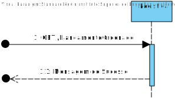
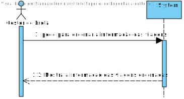
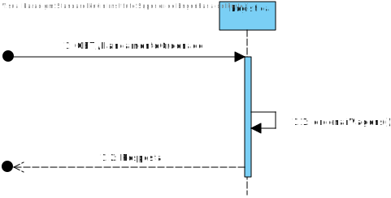
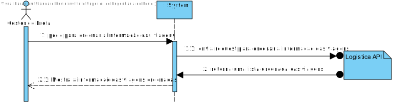
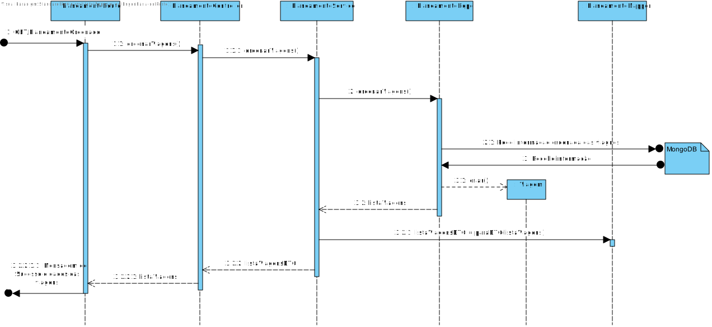
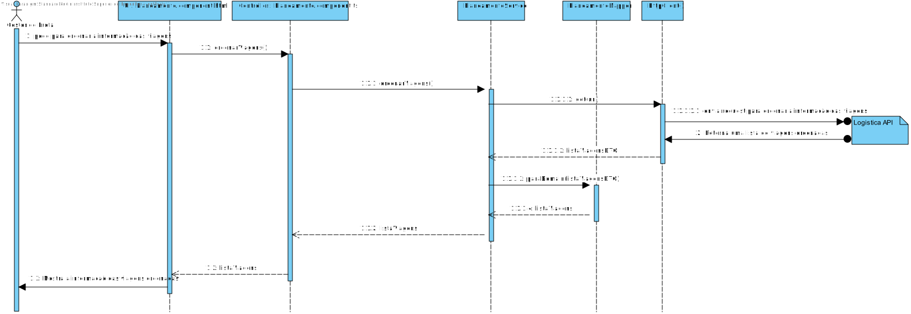

# US049
=======================================

# 1. Requisitos

Como gestor de logística pretendo filtrar e ordenar as viagens por Destino, Hora de entrega, Tempo de descarregamento (e outras caraterísticas)

### 1.1. Especificações e Clarificações do Cliente  

 **De clarificações do Cliente:**
 
>**Não existem clarificações no momento:** "O cliente, ainda não fiz nenhuma clarificação"
>

### 1.2. Critérios de Aceitação

Neste caso de uso, os critérios de aceitação encontrados foram:

- As Viagens devem ser ordenadas atraves de um atributo
- Deve ser possivel para o utilizador escolher por qual dos atributos quere ordenar as viagens a partir da UI

# 2. Análise

Esta User storie ira usar tanto o Backend (Logistica API) como o front end (SPA) pelo que os pedidos para ordenar as viagens serão feitas usando a Logistica.

# 3. Design

## 3.1. Nível 1

### SSD
#### Logistica API

#### SPA

## 3.2. Nível 2

### SD
#### Logistica API

#### SPA

## 3.3. Nível 3

### SD

#### Logistica API

#### SPA

### CD

## 3.4. Testes 

**Testes Unitários**

| | | |
| --- | --- | --- |
| **Módulo:** | SPA |
| **Objetivo:** | Testar os componentes do SPA usados para Listar Viagens |
| **Método de teste:** | Automático |
| **Cenário** | **Teste** | **Resultado Esperado** |
|  |  |  |

**Testes End-to-End**

| | | |
| --- | --- | --- |
| **Módulo:** | SPA |
| **Objetivo:** | Testar se a componente de Listar Viagens funciona com o resto do Sistema  |
| **Método de teste:** | Automático |
| **Cenário** | **Teste** | **Resultado Esperado** |
|  |  |  |

# 4. Observações

