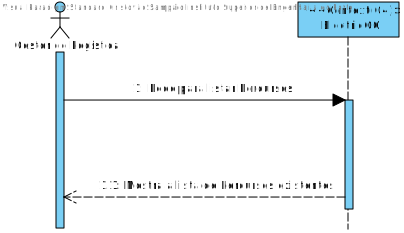
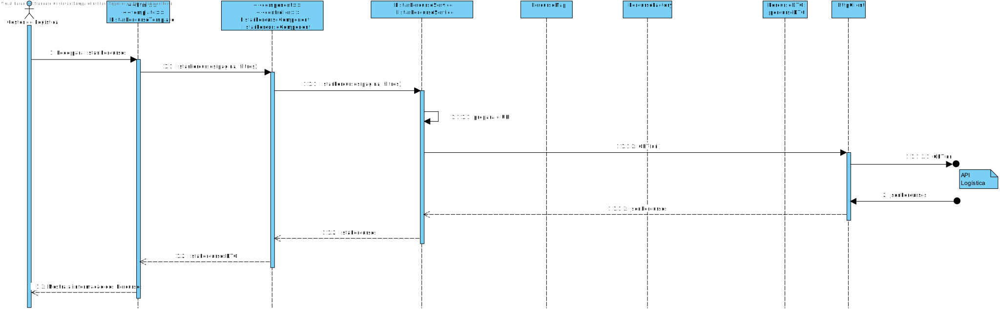
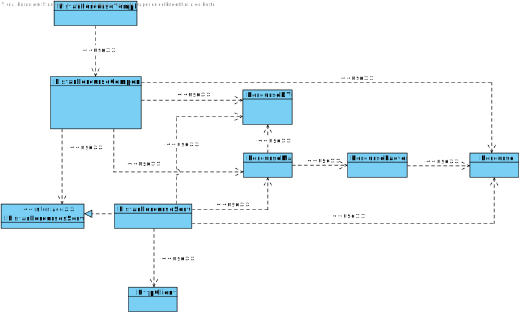

# US051
=======================================

# 1. Requisitos

Como gestor de logística pretendo listar os caminhos por página.

### 1.1. Especificações e Clarificações do Cliente  

 **Encontradas no Caderno de Encargos:**
 
>A informação que a empresa possui sobre os melhores caminhos entre dois armazéns são os seguintes:
>	- Identificação do armazém de partida
>	- Identificação do armazém de chegada
>	- Distância (em km)
>	- Tempo (em minutos) para percorrer a distância com o camião completamente cheio, ou seja, com a carga de 4,3 toneladas
>	- Energia gasta da bateria para percorrer essa distância com o camião completamente cheio (em kWh)
>	- Tempo extra se for necessário um carregamento extra da bateria (este dado é apenas diferente de 0 quando a carga das baterias a 80% feita previamente não é suficiente para percorrer completamente o troço, como por exemplo para um camião que carrega 4,3 toneladas e que tem de ir da Póvoa do Varzim para Arouca)

 **De clarificações do Cliente:**

>**Pergunta:** O que é pretendido quanto à listagem?
>
>Listar só um percurso, ou listar os percursos de acordo com uma determinda filtragem e ordem?
>
>Caso seja pretendida a segunda opção, deseja que seja ordenado e filtrado por que tipo de informação?
>
>**Resposta:** Deve ser possivel listar todos os percursos, podendo efetuar pesquisas/filtros sobre os mesmos, nomeadamente sobre o armazem origem e/ou armazem destino.

>**[Pergunta:](https://moodle.isep.ipp.pt/mod/forum/discuss.php?d=19868)** O que quer dizer com listar por página, nesta US e similares? Existir paginação para andar para a frente e para trás?
>
>**Resposta:** Exatamente. Deve ser possível visualizar os resultados em páginas. O utilizador deve poder escolher quantos resultados por página pretende e ter a possibilidade de navegar para a página anterior ou posterior.

### 1.2. Critérios de Aceitação

Neste caso de uso, os critérios de aceitação encontrados foram:

- Deve ser possível Listar um Percurso já existente
- Deve ser possível aplicar filtros (nomeadamente sobre o armazem de origem e/ou armazem destino)
- Um percurso deve ter os seguintes dados:
	- Identificação do armazém de partida
	- Identificação do armazém de chegada
	- Distância (em km)
	- Tempo (em minutos) para percorrer a distância com o camião completamente cheio, ou seja, com a carga de 4,3 toneladas
	- Energia gasta da bateria para percorrer essa distância com o camião completamente cheio (em kWh)
	- Tempo extra se for necessário um carregamento extra da bateria

# 2. Análise

Este UC faz uso dos seguintes agregados:
- Percurso

[(Domain Diagram)](../../Modelo_de_Dominio/DM.svg)

Como podemos ver esta US acaba por ser muito parecida com a [US023](../US023/US023.md) a única diferença é que agora temos explicita a necessidade de fazer a paginação, que olhando para a análise da [US023](../US023/US023.md) podemos verificar que isto era algo que já se tinha em conta quando se desenvolveu a US anterior, sendo assim esta US vai ser usada para melhorar o que foi desenvolvido anteriormente.

Em primeiro lugar será melhor começar a usar interfaces e não chamar diretamente o Serviço que vamos utilizar, assim tornasse mais fácil de no futuro caso seja necessário, editar o funcionamento desta US.

Depois seria bom que também fosse possível ver um valor total de Percursos em vez de ser necessário carregar no botão para a próxima página até chegar ao fim para ter uma ideia de quantos percursos temos. Ao fazer isto também vai passar a ser possível o uso de botões que nos levam para uma página expecifica, por exemplo para a primeira e última página, sem ter de passar por todas as restantes.

# 3. Design

No que toca ao design, tal como mencionado anteriormente, esta US é praticamente a mesma que a [US023](../US023/US023.md), então os diagramas usados acabam por ser os mesmos.
O que vai ser possível adicionar nesta US no entanto, é os diagramas referentes ao Back-end, isto é, ao API de Logística. 

## SPA
### 3.1. Nível 1

#### SSD

### 3.2. Nível 2

#### SD

### 3.3. Nível 3

#### SD

#### CD

---

## Logística
### 3.1. Nível 1

#### SSD

### 3.2. Nível 2

#### SD

### 3.3. Nível 3

#### SD

#### CD

## 3.4. Testes 

**Testes Unitários**

| | | |
| --- | --- | --- |
| **Módulo:** | SPA |
| **Objetivo:** | Testar os componentes do SPA usados para Listar Percursos  |
| **Método de teste:** | Automático |
| **Cenário** | **Teste** | **Resultado Esperado** |
|  |  |  |

**Testes End-to-End**

| | | |
| --- | --- | --- |
| **Módulo:** | SPA |
| **Objetivo:** | Testar se a componente de Listar Percursos por página funciona com o resto do Sistema  |
| **Método de teste:** | Automático |
| **Cenário** | **Teste** | **Resultado Esperado** |
| Mudar filtro do Armazém de Origem | Percursos que estão a ser listados | Os armazéns listados apenas devem conter o armazém de origem especificado  |
| Mudar filtro do Armazém de Destino | Percursos que estão a ser listados | Os armazéns listados apenas devem conter o armazém de destino especificado  |
| Mudar filtro de ambos Armazéns | Percursos que estão a ser listados | Apenas deve listar 1 Percurso que contém os dois armazéns especificados |
| Abrir página para listar Percursos | Verificar estado do botão Anterior | Deve começar com o botão Anterior desativado |
| Clicar no botão "Próximo" | Verificar estado do botão Anterior | Deve ativar o botão Anterior ao ir para a próxima página |
| Voltar para a primeira página da listagem | Verificar estado do botão Anterior | Deve desativar o botão Anterior ao voltar para a primeira página |
| Definir número de percursos por página para 10 | Número de percursos que estão a ser listados | Deve listar apenas 10 percuros disponiveis |
| Definir número de percursos por página para 15 | Número de percursos que estão a ser listados | Deve listar apenas 15 percuros disponiveis |
| Definir número de percursos por página para 20 | Número de percursos que estão a ser listados | Deve listar apenas 20 percuros disponiveis |
| Definir número de percursos por página para 25 | Número de percursos que estão a ser listados | Deve listar apenas 25 percuros disponiveis |
| Definir número de percursos por página para 30 | Número de percursos que estão a ser listados | Deve listar apenas 30 percuros disponiveis |

# 4. Observações