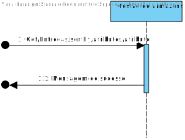
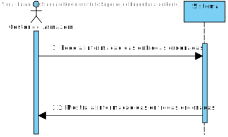
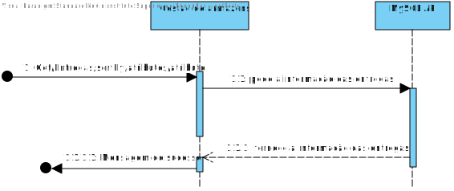
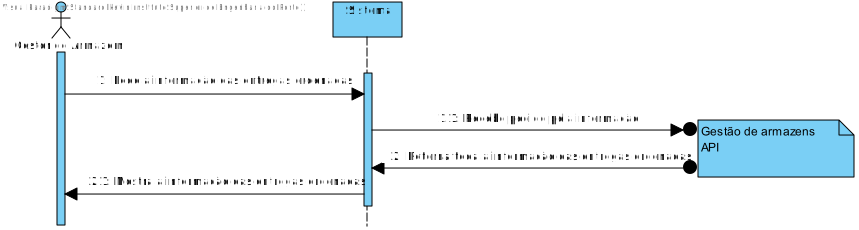
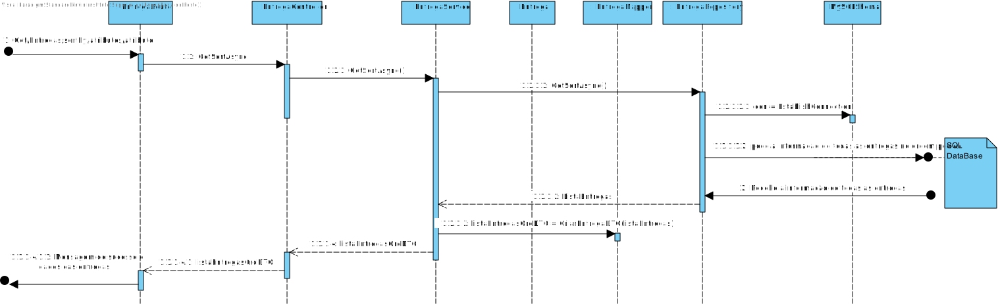
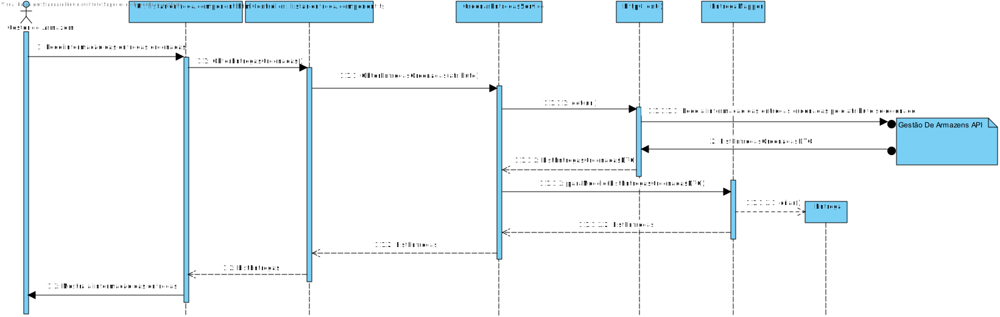
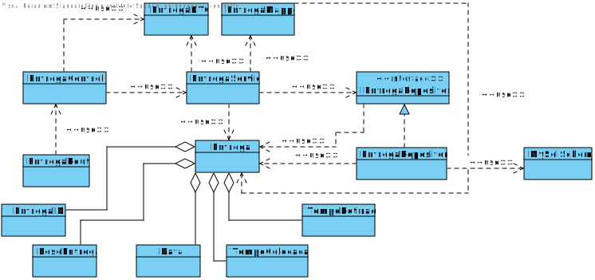
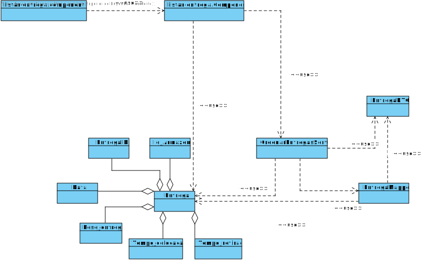

# US052
=======================================

# 1. Requisitos

Como gestor de armazém pretendo filtrar e ordenar as Entregas pelas suas caraterísticas.

### 1.1. Especificações e Clarificações do Cliente  

 **De clarificações do Cliente:**
 
>**Pergunta:** Caro Cliente,
Quais as caraterísticas que pretende que sejam utilizadas para a filtragem, sendo que estas devem ser no formato ascendente, descendente ou ambas as opções sendo posteriormente uma escolha sua?
>
>**Resposta:** bom dia,
os principais atributos a ordenar e filtrar são a data e o armazém de destino. a data deve ser ordenada por ordem cronologica inversa e o armazem ordenado de forma ascendente.
>
>**Pergunta:** Caro Cliente,
Gostariamos de saber se ao darmos a possibilidade de ordenar ou filtrar qualquer parámetro, seria um problema, ou seja, poder ordenar e filtrar o Id, data, massa, warehouse e tempo de carga e descarga. Pois foi assim que foi implementado, pois acreditamos que dará uma maior liberdade ao cliente.
>
>**Resposta:** boa tarde,
não tem problema em poder ordenar por qualquer atributo. verifiquem se estão a ordenar corretamente os atributos tendo em cotna o seu dominio de valores. por exemplo, as datas são ordenadas cronologicamente, as designações ordenadas alfabeticamente e a massa ordenada numericamente

### 1.2. Critérios de Aceitação

Neste caso de uso, os critérios de aceitação encontrados foram:

- As Entregas devem ser ordenadas atraves de um atributo
- Deve ser possivel para o utilizador escolher por qual dos atributos quere ordenar as entregas a partir da UI

# 2. Análise

Este UC faz uso dos seguintes agregados:
- Entrega 

[(Domain Diagram)](../../Modelo_de_Dominio/DM.svg)

Esta User storie ira usar tanto o Backend como o front end do pelo que as mudanças aos armazens terão de ser guardadas em sql usando a gestão de armazens.

# 3. Design

## 3.1. Nível 1

### SSD

## 3.2. Nível 2

### SD

## 3.3. Nível 3

### SD

### CD

## 3.4. Testes 

**Testes Unitários**

| | | |
| --- | --- | --- |
| **Módulo:** | SPA |
| **Objetivo:** | Testar os componentes do SPA usados para Listar Entregas |
| **Método de teste:** | Automático |
| **Cenário** | **Teste** | **Resultado Esperado** |
|  |  |  |

**Testes End-to-End**

| | | |
| --- | --- | --- |
| **Módulo:** | SPA |
| **Objetivo:** | Testar se a componente de Listar Entregas funciona com o resto do Sistema  |
| **Método de teste:** | Automático |
| **Cenário** | **Teste** | **Resultado Esperado** |
|  |  |  |

# 4. Observações

