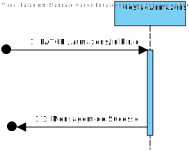
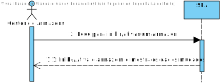
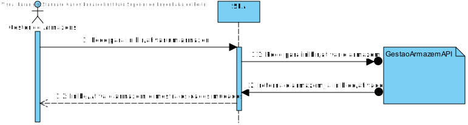

# US053
=======================================

# 1. Requisitos

Como gestor de armazéns, pretendo inibir um armazém.

### 1.1. Especificações e Clarificações do Cliente  

 **De clarificações do Cliente:**
 
>**Pergunta:** "Caro cliente, O que implica no sistema inibir um armazém?"
>
>**Resposta:** "Ao inibir um camião ou armazém estamos a temporariamente desabilitar o uso desse camião ou armazém. Nesse sentido não podem ser considerados os camiões ou armazena inibidos no planeamento.
>
>No caso da visualização o armazém deve ser apresentado com um modelo diferente ou com outra indicação visual que se encontra inibido, por exemplo, um sinal de exclamação por cima do armazém "

>**Pergunta:** "Como é que o planeamento deve reagir quando se depara com uma entrega cujo armazem de entrega esta inibido? Devera ser ignorada?"
>
>**Resposta:** "inibir o armazém implica que não seja possivel a existência de entregas a partir dessa data para esse arnazém. ou seja, quando criam uma entrega devem verificar a data da mesma e se o armazém se encontra inibido.".

### 1.2. Critérios de Aceitação

Neste caso de uso, os critérios de aceitação encontrados foram:

- Os Armazens devem conhecer se estao disponiveis ou não atraves de um novo atributo
- User stories passadas devem poder suportar este novo parametro
- Deve ser possivel para o utilizador Desativar e Ativar armaens a partir do UI

# 2. Análise

Este UC faz uso dos seguintes agregados:
- Armazém 

[(Domain Diagram)](../../Modelo_de_Dominio/DM.svg)

Esta User storie ira usar tanto o Backend como o front end do pelo que as mudanças aos armazens terão de ser guardadas em sql usando a gestão de armazens.

# 3. Design

## 3.1. Nível 1

### SSD

## 3.2. Nível 2

### SD

## 3.3. Nível 3

### SD

### CD

## 3.4. Testes 

**Testes Unitários**

| | | |
| --- | --- | --- |
| **Módulo:** | SPA |
| **Objetivo:** | Testar os componentes do SPA usados para Criar Percursos |
| **Método de teste:** | Automático |
| **Cenário** | **Teste** | **Resultado Esperado** |
|  |  |  |

**Testes End-to-End**

| | | |
| --- | --- | --- |
| **Módulo:** | SPA |
| **Objetivo:** | Testar se a componente de Criar Percursos funciona com o resto do Sistema  |
| **Método de teste:** | Automático |
| **Cenário** | **Teste** | **Resultado Esperado** |
|  |  |  |

# 4. Observações

