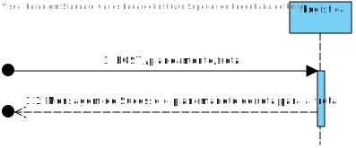
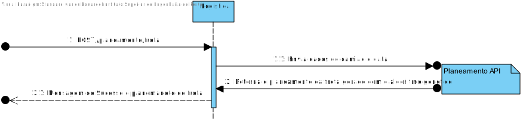
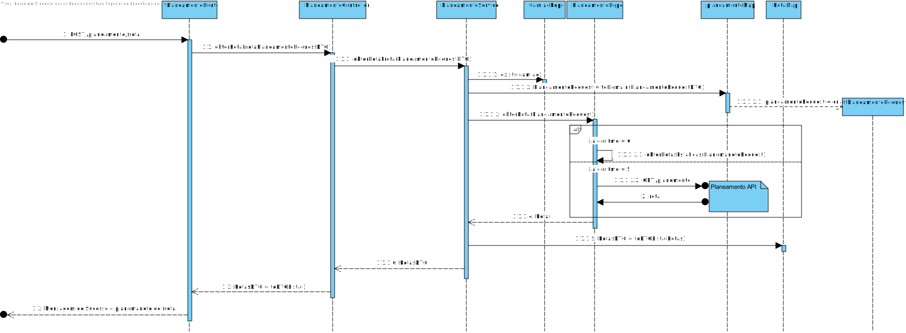
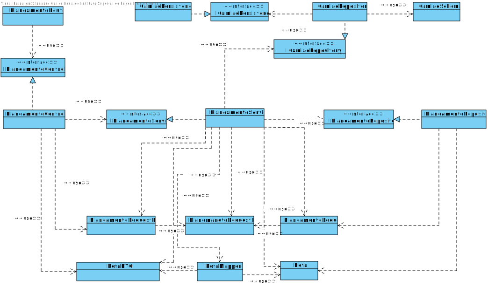

# US056
=======================================

# 1. Requisitos

Planeamento de frota: utilização de módulo de planeamento em Prolog e outro algoritmo simulado como estratégias distintas de planeamento

### 1.1. Especificações e Clarificações do Cliente  

 **Encontradas no Caderno de Encargos:**
 
 Como pode ser visto no caderno de encargos o planeamento é realizado pelo modulo "planeamento"

 **De clarificações do Cliente:**
 
>**Pergunta:** "Em relação à US de ARQSI 3.3.2 - 1.b "Planeamento de frota: utilização de módulo de planeamento em Prolog e outro algoritmo simulado como estratégias distintas de planeamento", gostaríamos de confirmar o que é que entende por "outro algoritmo simulado como estratégias distintas de planeamento"?"
>
>**Resposta:** "este requisito pretende acima de tudo que a solução seja flexivelk para no futuro poder substituir o módulo de planeamento por outro. nesse sentido o "algoritmo simulado" é um módulo de planeamento mas no qual o algoritmo utilizado não é funcional. por exemplo, retorna sempre o mesmo planeamento independentemente dos dados de input utilizados".

>**Pergunta:** "Quando se refere a um pedido do planeamento de toda a frota está a pedir seja possível ao cliente fornecer um dia e que seja exibido o planeamento de todos os camiões para esse dia?"
>
>**Resposta:** "Neste sprint para o módulo de Planeamento vamos considerar o planeamento usando mais do que um camião. O método de planeamento será baseado em Algoritmos Genéticos.
Os camiões têm caraterísticas idênticas".

>**Pergunta:** "O "algoritmo simulado" devera retornar o mesmo planemaneto independete do input do utilizador mas pode esclarecer o que este planemento "estatico" devera ser? É um planeamento por exemplo baseado em algumas informações presentes na base de dados  ou um planeamento estritamente defenido por nós?"
>
>**Resposta:** "trata-se de um algoritmo simulado. podem optar por devolver sempre os mesmos dados "hard coded" ou ajustar ligeiramente o output tendo em conta o input (data de planeamento) e os dados da BD (ex., camiões que existam e entregas que existam) mas sem se preocuparem com o "planeamento otimizado" da frota para esse dia"

"

### 1.2. Critérios de Aceitação

Neste caso de uso, os critérios de aceitação encontrados foram:

- Deve ser possivel obter o planemaento da frota de camiões para um dado dia
- Deve fornecer uma interface Rest para receber o pedido recebendo a informação do tipo de camião e o dia
- O calculo do planemaneto genetico deve ser feito atravez de um pedido ao modulo planemaneto
- O calculo do planemaneto simulado deve ser feito atravez de uma solução estatica
- Deve ser possivel escolher qual dos algoritmos devem ser usados

# 2. Análise

Este UC faz uso dos seguintes agregados:
- Camiao
- Planeamento

[(Domain Diagram)](../../Modelo_de_Dominio/DM.svg)

O agregado faz parte da area de Logitica do projeto integrador pelo que a UC tera de utilizar a base de dados mongodb

adicionalmento 2 algoritmos distintos devem ser produidos sendo estes identificados pelos seguintes numeros:

- Genetico = 5
- Simulado = 6

# 3. Design

Esta US usa uma interface grafica produzida em typescript oferecendo a interface do API usando o Node.js.

## 3.1. Nível 1

### SSD 

## 3.2. Nível 2

### SD 

## 3.3. Nível 3

### SD

### CD

## 3.4. Testes 

Dois tipos de Testes foram realizados

**Dominio**

Testes ao dominio da user storie EX: value objects, agregate root, DTO e Mapper

**Integraçao**

Testes aos controlers e servicos da User story.
É usado o mock da class de repositorio para testar eficientemente

